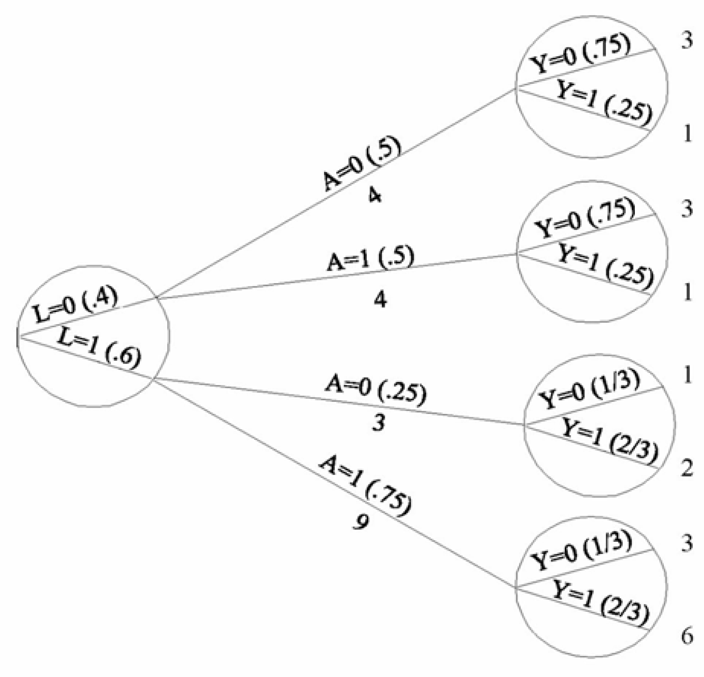
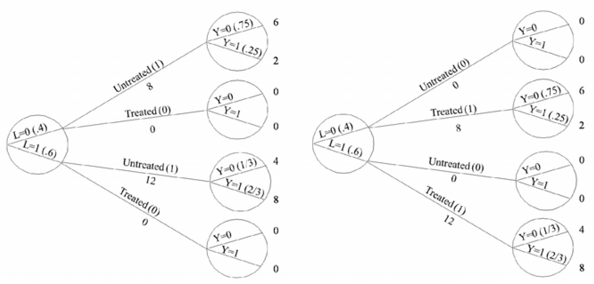
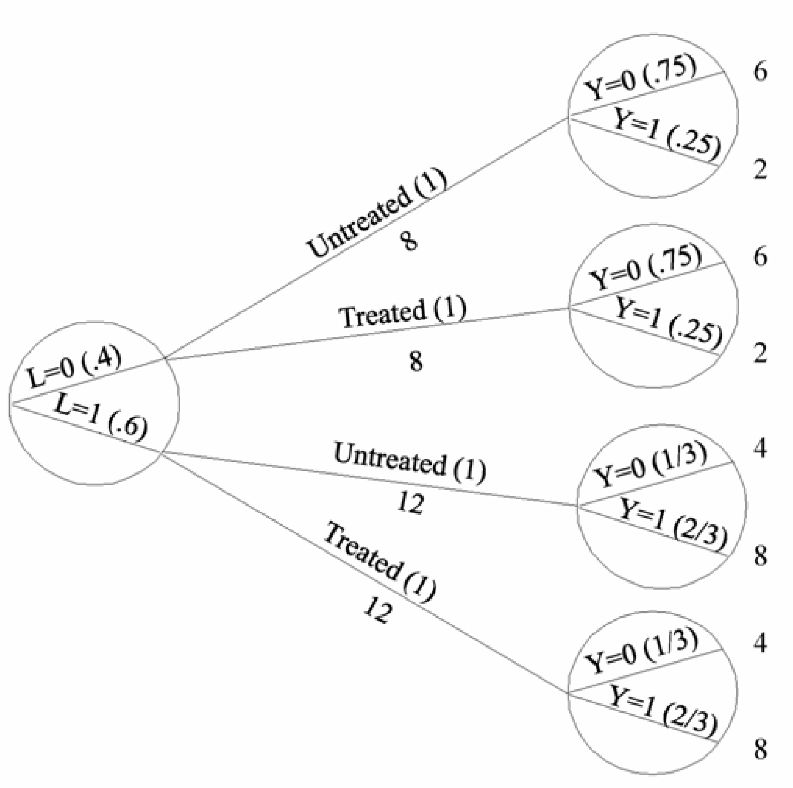

Data
==========

{height=600}

<h3>Stratified Experiment</h3>
<ul>
<li>Patients stratified by prognostic factor $L$</li>
<li>Treatment probablity conditioned on strata:
$$\text{Pr}[A|L=l] = \begin{cases}
    \frac{1}{2},& l=0 \text{ (non-critical)}\\
    \frac{3}{4},& l=1 \text{ (critical)}
\end{cases}$$
</li>
</ul>

---

## Representing Observations

{height=400}

- FRCISTG: Fully-Randomized Causally-Interpreted Structured Tree Graph (*Robins 1986, 1987*)
- binary tree, since all variables are binary
- represents partitioning of individuals in study 
- circles indicate non-treatment variables

---

## Representing Counterfactuals

{height=400}

- What if **none** were treated? What if **all** were treated?
- change $\text{Pr}[A|L]$ to 0 or 1, respectively
- compute outcomes using $\text{Pr}[Y^{a=0}|L]$ and $\text{Pr}[Y^{a=1}|L]$
- *conditional exchangeability* tells us $\text{Pr}[Y^{a}|L] = \text{Pr}[Y|A=a,L]$

---

## Combining Counterfactual Trees

{height=400}

- create a *pseudo-population* where all are both treated and untreated
- alternatively, think of it as a doubled population with half treated
- Note: here we have $A\perp \!\!\! \perp L$, so back to standard *exchangeability*

