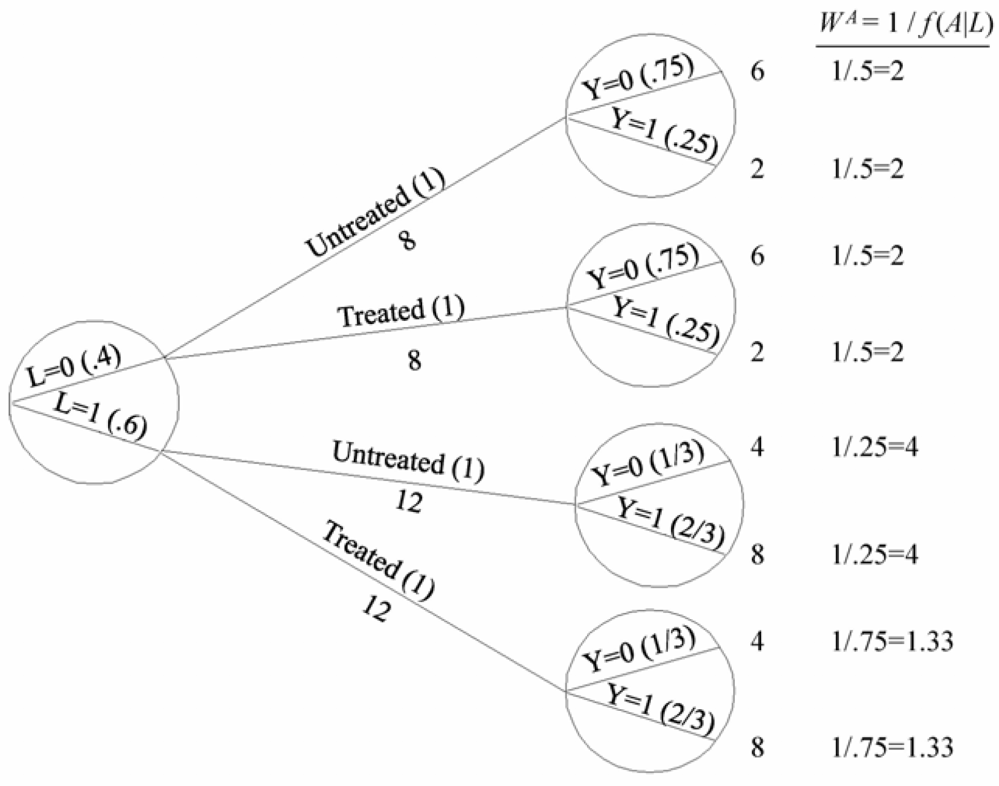

Review
============================
- *randomized controlled trials (RCTs)* can be used to estimate causal risk despite inability to observe counterfactuals 
- enabled by *exchangeability*, $Y^a\perp \!\!\! \perp A$
  - what treatment is actually given does not affect what would happened
  - alternatively, knowledge of how one would respond to a treatment does not enter into what assignment one is given
  - note: this is not $Y\perp \!\!\! \perp A$, which is what is being tested
- however, there may be covariates that may prompt different assignment rates
- *conditional randomization* partitions on covariates (forming *strata*)
- *standardization* can be used to compute a population level mean outcome for an assignment $A=a$

$$\sum\limits_l \text{E}[Y|A=a,L=l]\text{Pr}[L=l]$$

---

Data
==========

{height=600}

<h3>Stratified Experiment</h3>
<ul>
<li>Patients stratified by prognostic factor $L$</li>
<li>Treatment probablity conditioned on strata:
$$\text{Pr}[A|L=l] = \begin{cases}
    \frac{1}{2},& l=0 \text{ (non-critical)}\\
    \frac{3}{4},& l=1 \text{ (critical)}
\end{cases}$$
</li>
</ul>

---

## Representing Observations

{height=400}

- FRCISTG: Fully-Randomized Causally-Interpreted Structured Tree Graph (*Robins 1986, 1987*)
- binary tree, since all variables are binary
- represents partitioning of individuals in study 
- circles indicate non-treatment variables

---

## Representing Counterfactuals

{height=400}

- What if **none** were treated? What if **all** were treated?
- change $\text{Pr}[A|L]$ to 0 or 1, respectively
- compute outcomes using $\text{Pr}[Y^{a=0}|L]$ and $\text{Pr}[Y^{a=1}|L]$
- *conditional exchangeability* tells us $\text{Pr}[Y^{a}|L] = \text{Pr}[Y|A=a,L]$

---

## Combining Counterfactual Trees

{height=400}

- create a *pseudo-population* where all are both treated and untreated
- that is, we fill in the missing counterfactuals with unbiased estimates
- alternatively, think of it as a doubled population with half treated
- Note: here we have $A\perp \!\!\! \perp L$, so back to standard *exchangeability*

---

## Inverse Probability Weights

{height=400}

- we can directly obtain the outcome counts in the pseudo-population by computing weights
- **inverse probability weights** are scaling factors that convert observed counts to counterfactual counts
- for each leaf node, the IP weight is $\frac{1}{\text{Pr}[A=a|L=l]}$
- or, generally $W^A = \frac{1}{f[A|L]}$

---

## Causal Risk Using IP Weighting

- IP weights can be used to compute causal risk measures
- mathematically, the IPW mean outcome for treatment $A=a$ is written

$$\text{E}\left[ \dfrac{I(A=a)Y}{f[A|L]}\right] $$

- therefore, the unbiased estimator for the causal risk ratio is

$$
\dfrac{\text{E}\left[ \dfrac{I(A=1)Y}{f[A|L]}\right]} {\text{E}\left[ \dfrac{I(A=0)Y}{f[A|L]}\right]}
$$

- filling in the pseudo-population numbers from our study,

$$ \dfrac{\left(\frac{2+8}{20}\right)}{\left(\frac{2+8}{20}\right)} = \frac{0.5}{0.5} = 1$$

---

## Proof of Identities

**IPW Mean**
$$  
\begin{aligned}
\text{E}\left[ \dfrac{I(A=a)Y}{f[A|L]}\right] &=
\sum\limits_l \frac{1}{f[a|L]}\text{E}[Y|A=a,L=l]f[a|l]\text{Pr}[L=l] &
(\text{E}[X]=\sum\limits_x x\text{Pr}[X=x])\\
&= \sum\limits_l \text{E}[Y|A=a,L=l]\text{Pr}[L=l] & \textbf{Standardized Mean} \\
&= \sum\limits_l \text{E}[Y^a|A=a,L=l]\text{Pr}[L=l] & (Y^a = Y|A=a) \\
&= \sum\limits_l \text{E}[Y^a|L=l]\text{Pr}[L=l] & (Y^a \perp \!\!\! \perp A | L)\\
&= \text{E}[Y^a] & \textbf{Causal Risk}
\end{aligned}
$$

Note: The above assumes $f[a|L] > 0$. That is, all strata must include randomization.

---

## Exercise: Transferability of Results

- previous study was performed at Mount Olympus, where $\text{Pr}[L]=0.6$
- the population of Asgard has $\text{Pr}[L]=0.4$
- *can you use standardization or IPW to estimate causal risk for this population?*
- if so, justify and compute
- otherwise, explain why not

---

## Exercise: Failure to Adhere
- suppose the treatment involved taking self-administered medicine
- at the close, clinicians learn two low-risk patients never took the medicine despite being in the treatment group
- of these, one survived and one died
- *how should this be handled?*
- discuss possible approaches, including recomputed causal risk ratios

---

## Case Study: ECMO and the Ethics of RCTs

- in 1980, pulmonary hypertension in newborns had **80% mortality**
- Bartlett et al. developed **extracorporeal membrane oxygenation (ECMO)** and reported **80% survival** in 1982
- to provide unbiased causal evidence, they chose to conduct a randomized trial, but elected to use a modified version because they

> "*anticipated that [in such a trial] most ECMO patients would survive and most control patients would die.*"

- they used a *randomized play-the-winner* design where $i$-th treatment is assigned using:
$$\text{Pr}[A_i] = \dfrac{1 + \text{#(treated & survived)}}{2 + \text{# survived}} = \dfrac{1 + \sum\limits_{j=1}^{i-1}{(1-Y_j) I(A_j=1)}}{2 + \sum\limits_{j=1}^{i-1}{(1-Y_j)}}$$

---

## Case Study: ECMO and the Ethics of RCTs

- Results:
  - first was treated and survived
  - second was untreated and died
  - remaining 9 were treated and all survived

- statisticians argued that this was improper randomization and failed to conclusively demonstrate superiority of ECMO
- an RCT was then performed, with $\alpha=0.05$ and a stopping rule of four deaths in either arm
- 9 assigned to ECMO (all survived), 10 to control (four died), yielding $p=0.054$
- *Should these results be considered strong scientific evidence for favoring ECMO over the standard of care?*
- *Were these trials ethical?*

*Source:* John Worrall (2008) "Evidence and Ethics in Medicine."

---

## Thank You

**Questions and Discussion**

