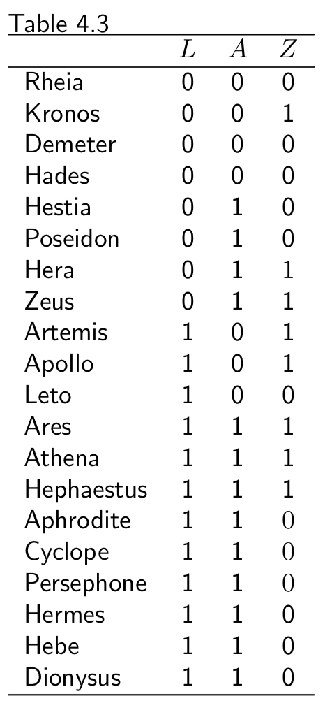

```{r setup, include=FALSE}
options(htmltools.dir.version = FALSE)
```


## Review previous session
### Effect modification
- *Modifier* V = Sex (1 female, 0 male)  
- *Treatment* A = heart transplant (1 transplant, 0 no-transplant) 
- *Outcome* Y = Mortality (1 death, 0 survival)   

→ V is a modifier of the effect of A on Y when the average causal effect of A on Y varies across levels of V   

- *qualitative effect modification* = when the average causal effect in the subsets V = 1 and V = 0 are in the opposite direction 

### Why care about effect modification
1. The average causal effect in a population depends on the distribution of individual causal effects in the population
2. Evaluating the presence of effect modification is helpful to identify the groups of individuals that would benefit most from an intervention
3. Help understand the biological, social, or other mechanisms leading to the outcome


## 4.4 Stratification as a form of adjustment
### Adjustment
- To compute the average causal effect in the entire population in the absence of marginal randomization
- Ensure conditional exchangeability of the treated and the untreated for variable L

### To identify effect modification by variables V 
- stratify by V before adjusting for L
- standardization (or IP weighting) is used to adjust for L and stratification is used to identify effect modification by Y
- *In fact, the use of stratification as a method to adjust for L is so widespread that many investigators consider the terms “stratification” and “adjustment” as synonymous.*


## 4.5 Matching as another form of adjustment
- The goal of matching is to construct a subset of the population in which the variables have the **same distribution in both the treated and the untreated**. 
- *matching pair* = each untreated individual and her corresponding treated individual (one-to-one)
- *matching set* = each untreated individual and her corresponding treated individuals (one-to-many)
- *matching factor* = variable L
 
- The choose group defines the subpopulation on which the causal effect is being computed.    
→ the following example computes the *effect in the untreated*


## *How matching works*
1. untreated individual in non-critical condition (A=0,L=0), randomly matched with (A=1,L=0)
2. untreated individual in critical condition (A=0,L=1), randomly matched with (A=1,L=1)
3. the assumption of *conditional* exchangeability given L is expend to (*unconditional*) exchangeability of the treated and the untreated in the matched population
4. the risk in the treated (=3/7) and untreated (=3/7) is equal → causal risk ratio = 1

<div class="columns-2">
```{r echo=FALSE}
Name = c("Rheia", "Kronos", "Demeter", "Hades", "Hestia", "Poseidon", "Hera", "Zeus", "Artemis", "Apollo", "Leto", "Ares", "Athena", "Hephaestus", "Aphrodite", "Cyclope", "Persephone", "Hermes", "Hebe", "Dionysus")
L = c(rep(0, 8), rep(1, 12))
A = c(rep(0,4), rep(1,4), rep(0,3), rep(1,9))
Y = c(0,1,rep(0,5), rep(1,3), 0, rep(1,6), rep(0,3))

table = data.frame(L = L, A = A, Y = Y)
rownames(table) = Name
```

```{r echo=FALSE}
print("(A=0,L=0) individuals matched with (A=1,L=0)")
table[c("Rheia", "Hestia", "Kronos", "Poseidon", "Demeter", "Hera", "Hades", "Zeus"),]

print("(A=0,L=1) individuals matched with (A=1,L=1)")
table[c("Artemis", "Ares", "Apollo", "Aphrodite", "Leto", "Hermes"),]
```
</div>


## 4.6 Effect modification and adjustment methods
- Standardization, IP weighting, stratification/restriction, and matching are different approaches to **estimate average causal effects** ($\operatorname{Pr}\left[Y^{a=1}=1\right] \neq \operatorname{Pr}\left[Y^{a=0}=1\right]$), but they estimate **different types of causal effects**.   

### Different types of causal effects
- To compute either marginal or conditional effects → standardization or IP weighting
- To compute conditional effects in certain subsets of the population → stratification/restriction, matching
- All requires *exchangeability* ($Y^a\perp \!\!\! \perp A$) and *positivity*.


## 4.6 Effect modification and adjustment methods
### In the absence of effect modification, 
- the effect measures (risk ratio or risk difference) computed via four approaches (standardization, IP weighting, stratification/restriction, and matching) will be equal.   

### Examples from the previous chapters   
*1. In the entire population of Table 2.2 (standardization and IP weighting)*   
*2. In the subset of the population in critical condition L = 1 and non critical condition L = 0 (stratification)*   
*3. In the untreated (matching)*   


## *Examples from the previous chapters*
**1. Standardization/ IP weighting** 
$$\dfrac{\text{Pr}\left[Y^{a=1}=1\right]}{\text{Pr}\left[Y^{a=0}=1\right]} = \frac{\sum\limits_l \text{Pr}\left[Y=1|A=1,L=l\right]\text{Pr}[L=l]}{\sum\limits_l \text{Pr}\left[Y=1|A=0,L=l\right]\text{Pr}[L=l]} = \frac{\frac{1}{2}}{\frac{1}{2}} = 1$$

**2. Stratification**   
$$\begin{align*}
\dfrac{\text{Pr}\left[Y^{a=1}=1|L=1\right]}{\text{Pr}\left[Y^{a=0}=1|L=1\right]}=\frac{\frac{6}{9}}{\frac{2}{3}}=1 && \text{critical (L = 1)} \\
\dfrac{\text{Pr}\left[Y^{a=1}=1|L=0\right]}{\text{Pr}\left[Y^{a=0}=1|L=0\right]}=\frac{\frac{1}{4}}{\frac{1}{4}}=1 && \text{non-critical (L = 0)}
\end{align*}$$

**3. Matching**   
The risk in the treated (=3/7) and untreated (=3/7) is equal. → causal risk ratio = 1


## *However, the effect measures often vary...*
<div class="columns-2">
{height=500}

### Table 4.3
- *Strata* L = prognostic factor (1 critical, 0 otherwise)
- *Treatment* A = heart transplant (1 transplant, 0 no-transplant) 
- *Outcome* Z = high blood pressure (1 yes, 0 otherwise)
- Assume exchangeability and positivity hold
</div>


## *The effect measures with effect modification*
**1. Standardization/ IP weighting** 
$$\dfrac{\text{Pr}\left[Z^{a=1}=1\right]}{\text{Pr}\left[Z^{a=0}=1\right]}=0.8$$
**2. Stratification**
$$\begin{align*}
\dfrac{\text{Pr}\left[Z^{a=1}=1|L=0\right]}{\text{Pr}\left[Z^{a=0}=1|L=0\right]}=2.0 && \text{stratum L = 0} \\
\dfrac{\text{Pr}\left[Z^{a=1}=1|L=1\right]}{\text{Pr}\left[Z^{a=0}=1|L=1\right]}=0.5 && \text{stratum L = 1}
\end{align*}$$


**3. Matching**
$$\dfrac{\text{Pr}\left[Z^{a=1}=1|A=0\right]}{\text{Pr}\left[Z=1|A=0\right]}=1$$

## *Four correct causal risk ratios*
*How?*  qualitative effect modification

### 1. Standardization/ IP weighting
- the average causal effect *in the population* (causal risk ratio 0.8) is beneficial (Technical point 4.3)

### 2. Stratification
- treatment **doubles** the risk among individuals in non-critical condition (L = 0, causal risk ratio 2.0)
- treatment **halves** the risk among individuals in critical condition (L = 1, causal risk ratio 0.5)

### 3. Matching
- The causal effect in the *untreated* is null (causal risk ratio 1.0)   
= the larger proportion of individuals in noncritical condition in the untreated compared with the entire population 


## Take-home message
### Prerequisite for a valid causal inference:
- **[Chapter 3]** From observational study → a well-defined causal effect 
- **[Chapter 4]** Under the presence of effect modification → a well characterized target population 

