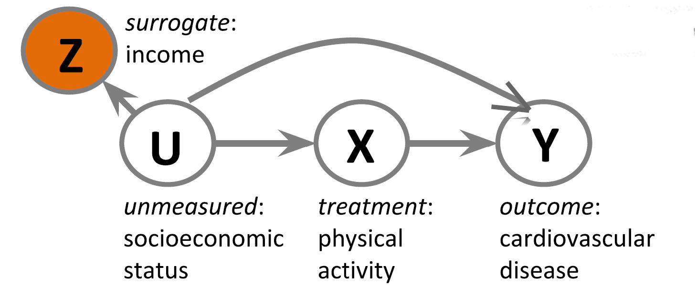
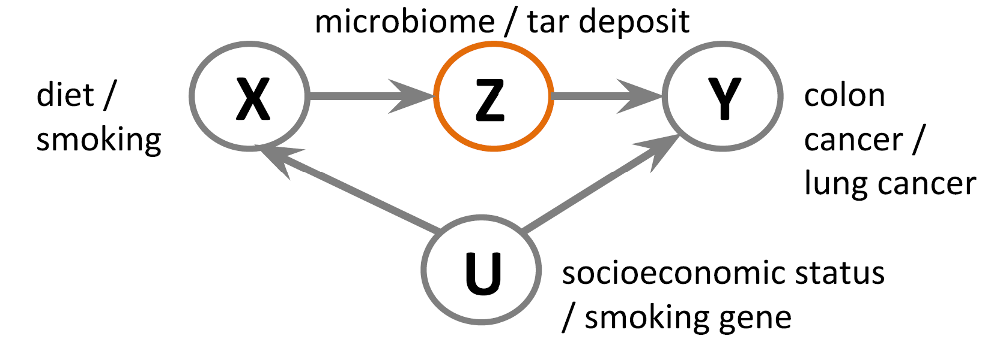
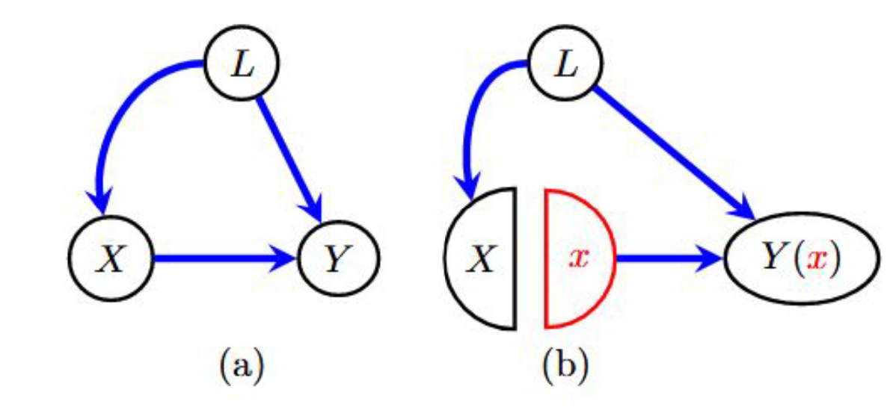
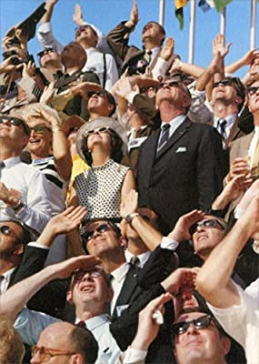
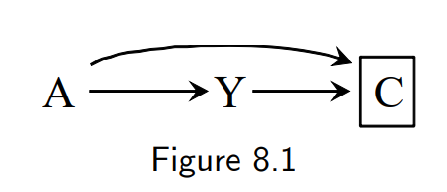
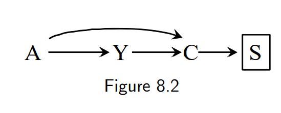
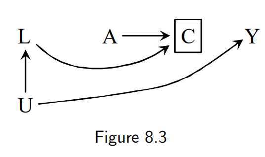
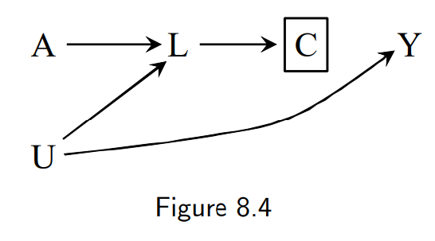
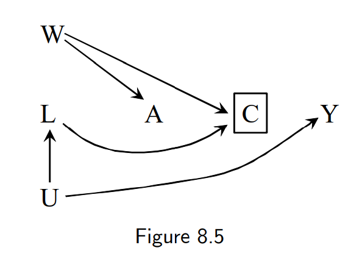
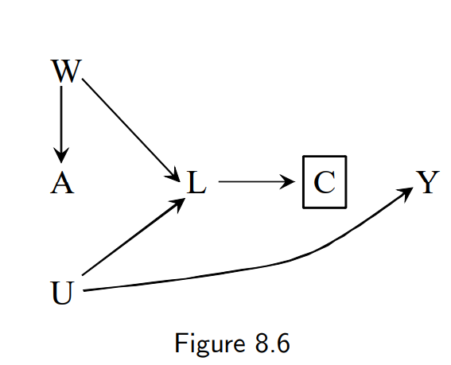

```{r setup, include=FALSE}
options(htmltools.dir.version = FALSE)
```


## Review previous session
### Surrogate confounders
- Can use a measured variable as a replacement for an unmeasured variable for back-door adjustment
{height=175px}

### Negative outcome controls
- Use variables with a known causal effect = 0
  - Can determine confounding is present if the observed causal effect ≠ 0
  
## Review previous session
### Front-door adjustment
- Method for closing a backdoor pathway even when the confounder is unmeasured using a shielding mediator

{height=150px}

### Single world intervention graphs (SWIGs)
- Encodes counterfactual independences of a hypothetical intervention

{height=150px}


## Example
- Imagine an investigator wanted to ask "Does looking up at the sky make other pedestrians look up too?"
- She conducts a randomized experiment and finds a strong association
- Is this effect causal?
  - No confounding expected (randomized experiment)
- However, the people who participated in the experiment may differ from those who refused to consent to participate.
- People who refused to participate may be more shy and therefore less likely to look up
- As a result, the researcher has selected a group of participants who were more likely to look up when someone else looked up
  - Thus, she has potentially created an association where there is not one




## 8.1 The Structure of Selection Bias


- This diagram depicts a dichotomous treatment A, outcome Y, and a common effect C
  -This common effect of the treatment and the outcome is sometimes called a "collider"
- The box around C indicates that it was conditioned on (i.e. that participants were selected for this study who only had a certain value such as C = 0)
- An analysis conditioned on C will generally result in an association between A and Y

{height=250px}

## Simple Example
{height=250px}

- A = folic acid supplements given to pregnant women to prevent cardiac malformation
- Y = cardiac malformation (1 = Yes, 0 = No)
- C = fetus death before birth (1 = Yes, 0 = No)
- If the study is restricted to fetuses that survived birth then the study is conditioned on C = 0

## Mathematical rationale for selection bias
{height=250px}

$\frac{Pr[Y=1|A=1, C=0]}{Pr[Y=1|A=0, C=0]} ≠ \frac{Pr[Y^{a=1}=1]}{Pr[Y^{a=0}=1]}$

In words, the observed associational risk ratio conditioned on C=0 is not equal to the causal risk ratio

## Another example of selection bias
{height=250px}

- S represents a node that was selected on
- In the folic acid example, imagine that the researchers did not condition on fetus death before birth but that grieving parents (S = 1) did not agree to participate but non-grieving parents (S = 0) did
- Conditioning on S which is affected by C also opens the path A -> C <- Y

## Selection bias
- Selection bias presented in figures 8.1 and 8.2 can arise whether there's an arrow from A to Y or not
  - This is called bias under the null

{height=175px}
{height=175px}

## Selection bias due to loss to follow-up
{height=250px}

- Example: A is antiretroviral therapy for people living with HIV, Y is 3-year death risk, U is immunosuppression, C is censoring (loss to follow-up), and L is unmeasured HIV-related symptoms and biomarkers
- According to rules of d-separation, conditioning on C opens the A -> C <- L <- U -> Y pathway

## Other models of selection bias
{height=250px}

- Treatment A causes symptoms L which leads to censoring C
- As with figure 8.3, conditioning on C opens the A -> L <- U -> Y pathway
- Hydroxychloroquine (A) causes heart arrythmia (L) which results in participant dropout (C); COVID-19 may also affect the heart (U) and cause mortality (Y)

## Other models of selection bias
{height=250px}

- W indicates unmeasured lifestyle/personality variables that both determine treatment (A) and study visit attendance (C)
- Example: study of HIV adherence counseling where participants who are determined to be at high risk of nonadherence are assigned to additional counseling. As a result, unmeasured lifestyle factors affect both treatment (A) and attendance (C).

## Other models of selection bias
{height=250px}

- W indicates unmeasured lifestyle/personality variables that both determine treatment (A) and threshold for symptoms reporting (L)
- Example: physicians in a study of a new painkiller (A) are unconsciously affected by cultural biases for pain management (W) as well as how severe they assess pain symptoms to be (L)

## 8.2 Examples of selection bias
- *Differential loss to follow-up* represented in figures 8.3 to 8.6 as discussed.
- *Missing data bias, nonresponse bias* replacing censoring (loss to follow-up) with missing data due to missing assessments or refusal to provide certain data. Restricting analyses to complete cases may induce selection bias.
- *Healthy worker bias* arises when unmeasured health status (U) is indicative of both death (Y) and being at work (C).
- *Self-selection, volunteer bias* occurs when agreement to participate (C) is affected by unmeasured health status (U) with a mediating factor (L).
- *Selection affected by treatment received before study entry* can occur when participation (C) is affected by pre-study treatment (A)

## Selection bias and randomized experiments
- **Randomization protects against confounding, but not against selection bias when the selection occurs after randomization**
- Selection bias can occur in randomized experiments
  - Figures 8.3 and 8.4 can represent such selection bias due to loss to follow-up or study dropout
  - Individuals who remained in the study (C = 0) may not be exchangeable with individuals who were lost (C = 1)
  - However, volunteer bias cannot occur due to no possibility of a common cause with the treatment (A) and because a randomized treatment cannot cause participation (C)
  {height=175px}
  {height=175px}
  
## Selection bias and observational studies
- Selection bias in observational studies can be due to both loss to follow-up or volunteer bias (or both)
{height=175px}
{height=175px}
{height=175px}
{height=175px}
  
## 8.3 Selection bias and confounding
There are two major causes of lack of exchangeability between treated and untreated:

1. *Confounding* or common causes of the treatment and outcome
2. *Selection bias* or conditioning on a common effect of the treatment and outcome

Regardless of whether lack of exchangeability is caused by confounding or selection bias, it is handled the same way: by adjusting for the common cause or conditioned on common effect.

## Adjusting for selection bias
Since confounders and selection bias can both be handled by adjustment, why differentiate between the two?

1. Structure of the bias affects methodological choices. Stratification to adjust for confounding in longitudinal studies with time-varying treatments can introduce selection bias
2. A structural understanding of the problem can inform study design
3. Conditioning on pre-treatment variables can explain why some variables appear to behave as confounders in some studies but not others

## Conclusions
- Selection bias occurs when study participation is conditioned on a common effect (sometimes called a collider)
- Selection bias, along with confounding, are two major causes of lack of exchangeability between treated and untreated groups in studies
  - The method for handling both is often the same: adjustment
- Understanding selection bias and confounding structurally is still essential to prevent unintended consequences such as introducing selection bias after stratifying to prevent confounding
