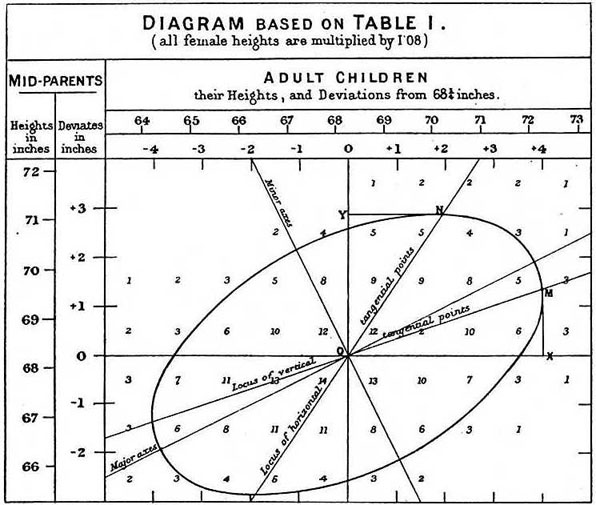
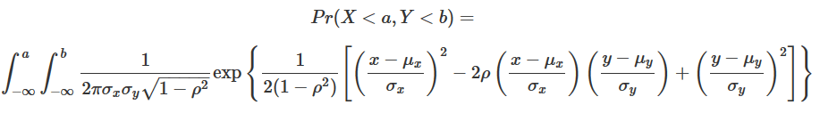

## Motivating Examples

We will describe three examples from the life sciences: one from physics, one related to genetics, and one from a mouse experiment. They are very different, yet we end up using the same statistical technique: fitting linear models. Linear models are typically taught and described in the language of matrix algebra.

## Falling objects

Galileo sends his grad students to collect data. We'll generate data that might be similar to what they collect: measurements of the height of a ball dropped off the Tower of Pisa at various time points.

```{r}
set.seed(1)
g <- 9.8              ##meters per second
n <- 25
tt <- seq(0,3.4,len=n) ##time in secs, 
                      ##note: we use tt because t is a base function
d <- 56.67  - 0.5*g*tt^2 + rnorm(n,sd=1) ##meters
```

##

```{r}
plot(tt, 
     d, 
     ylab="Distance in meters", 
     xlab="Time in seconds"
)
```


## Linear model produces non-linear graph

$$Y_i = \beta_0 + \beta_1x_i + \beta_2x_i^2+\varepsilon, i= 1,...,n$$

*A linear model is a linear (+ or -) combination of known quantities (the $x$s), and unknown quantities (the $/beta$s).*

$x$: known value collected as data

$\beta$: unknown parameter estimated from your data

$Y$: outcome

## Father & son heights

Francis Gaulton collect the heights of fathers and sons in the 19th century, suspecting that height is inherited.

```{r, message=F, warning=F, echo=F}
library(UsingR)
```
```{r}
head(father.son)
```

##
```{r, message=F, warning=F}
plot(x=father.son$fheight,
     y=father.son$sheight,
     xlab="Father's height",
     ylab="Son's height")
```

##

This data is well-represented by a linear model of this form. We consider the father's height to be fixed, so they are the lower case $x$ variables. The son's heights are variable, $Y$. 

$$Y_i=\beta_0+\beta_1x_i+\varepsilon,i=1,.,N$$

$\varepsilon$ cannot explain all of the variability in this data. Other variables, like mother's height and nutrition, for example, are not accounted for by this model. One could presumably improve this model by adding another variable for mother's height. 

## Random samples from multiple populations

The familiar dataset of mouse weights fed from high-fat or normal chow. 

```{r}
dat <- read.csv("../Chapter 1 - Inference/session7_section1.1/femaleMiceWeights.csv")
head(dat)
```
##

```{r}
stripchart(Bodyweight~Diet,
           data=dat,
           vertical=TRUE,
           method="jitter",
           pch=1,
           main="Mice weights")
```

##
A linear model can estimate whether there is a difference in mouse weight dependent on chow type.

$$Y_i=\beta_0+\beta_1x_i+\varepsilon_i$$

$\beta_0$: the chow diet average weight

$\beta_1$: the difference between averages group weights

$x_i=1$: mouse $i$ gets the high fat (hf) diet

$x_i=0$: mouse $i$ gets the chow diet

$\varepsilon_i$ differences between mice of the same population


## Linear models in general

All of the above linear models can be summarized by this equation

$$Y_i=\beta_0+\beta_1x_{i,1}+\beta_2x_{i,2}+...+\beta_2x_i,p+\varepsilon_i,i=1,...,n$$


Which can be summarized by this one

$$Y_i=\beta_0+\sum_{j=1}^p\beta_jx_{i,j}+\varepsilon_i,i=1,...,n$$

for any number of predictors, $p$.

## It's easier than it looks

$$Y_i=\beta_0+\sum_{j=1}^p\beta_jx_{i,j}+\varepsilon_i,i=1,...,n$$


That sigma is just a for loop. 

betazero: an intercept

betas: a list of coefficients, length of p

xes:  a matrix of covariates (observed from data), with columns for individuals and rows for covariates. Size is p rows and n columns

epsilons: a list of error terms, length of p

##

To evaluate for a given $Y$, $Y_i$:
```{r eval=F, echo=T}

mysum <- betazero

for(j in 1:p) {
  mysum <- mysum + beta[j] * xes[j, i]
}

mysum <- mysum + epsilons[i]


```


## Estimating parameters

Where do those $\beta$s come from? 

The goals for the three examples differ: 

Example 1: We want the best possible estimate of $\beta$ from the data so we have a better understanding of physical processes. 

Example 2: We want a good estimate of $\beta$ to understand a genetic process. 

Example 3: We want to know if $\beta_1$ is equal to zero: does the high-fat chow affect mouse weight? 

## Least-Squares estimation

$$RSS = argmin \sum_{i=1}^n \left(Y_i - \left( \beta_0+\sum_{j=1}^p\beta_jx_{i,j} \right) \right)^2$$

When we find the values of $\beta$ that minimize this equation, we call them the "least squares estimates" and denote them $\hat{\beta}$. 

These $\hat{\beta}$s are random variables. 

## Falling objects again

Equation for falling objects

$$d=h_0+v_0t - 0.5 ? 9.8t^2$$

We simulated Galileo's grad students' data with this equation, using $h_0=56.67$ and $v_0=0$. 

```{r}
g <- 9.8              ##meters per second
n <- 25
tt <- seq(0,3.4,len=n) ##time in secs, t is a base function

# d =  h0    - 0.5 x 9.8 x t^2
  f <- 56.67 - 0.5 * g   * tt^2
  
#And here we bring the noise
y <-  f + rnorm(n,sd=1)

```

##
```{r}
plot(tt,y,ylab="Distance in meters",xlab="Time in seconds")
lines(tt,f,col=2)
```

##

Now we model that data, as a parabola because "it looks right". The function $lm$ is easy to use and we'll get into how it works in a minute. This solves that hairy equation with $argmin$ in it and gives us our $\hat{\beta}$s.

```{r}
tt2 <-tt^2
fit <- lm(y~tt+tt2)
summary(fit)$coef
```


##Least Squares Estimate (LSE)

We're going to create our own solver for the residual sum of squares (rss). 

$$Y_i = \beta_0 + \beta_1x_i + \beta_2x_i^2+\varepsilon, i= 1,...,n$$

Remember this one? Here's a function to calculate the RSS for one set of possible $\beta$s.

```{r}
rss <- function(Beta0,Beta1,Beta2){
  r <- y - (Beta0+Beta1*tt+Beta2*tt^2)
  return(sum(r^2))
}
```


##
Now we fix two of the $\beta$s and vary the other. 
```{r}
Beta2s<- seq(-10,0,len=100)
plot(Beta2s,sapply(Beta2s,rss,Beta0=55,Beta1=0),
     ylab="RSS",xlab="Beta2",type="l")
```

```{r}
Beta2s<- seq(-10,0,len=100)
plot(Beta2s,sapply(Beta2s,rss,Beta0=55,Beta1=0),
     ylab="RSS",xlab="Beta2",type="l")
##Let's add another curve fixing another pair:
Beta2s<- seq(-10,0,len=100)
lines(Beta2s,sapply(Beta2s,rss,Beta0=65,Beta1=0),col=2)
```


##
<!-- Yes, the <center> tag has been deprecated since 1998. 
    I was too tired to find the newfangled way to do it. 
-->

<center>

</center>
##

Galton developed this calculus to solve for the effect of parental height on son height. 


The text does not thoroughly explain how this will reduce down to matrix algebra. 


##
<center>


</center>


