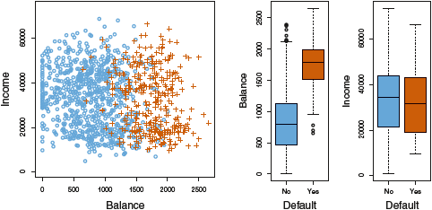
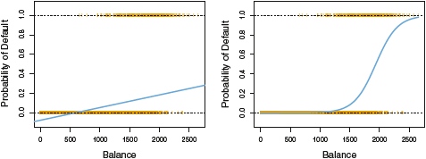
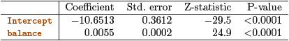
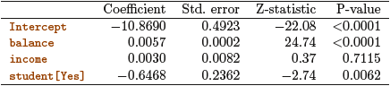
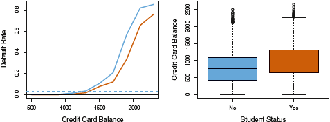

Classification and Logistic Regression
========================================================
author: Oliver Zichert
date: 28.11.2018
autosize: true

Table of contents
========================================================
1. Classification vs. Regression
2. Logistic Regression
3. Logistic Model
4. Making Predictions
5. Multiple Logistic Regression

Classification
========================================================
<!--- Pages 127-138 --->
Problem
- set of training observations $(x_{1},y_{1}),...,(x_{n},y_{n})$
- build a classifier to perform well also on test observations

Regression setting
- quantitive response i.e. $Y$ takes on numerical values like age, stopping distance etc.

Classification setting
- qualitative/categorical response i.e. $Y$ takes on values in one of $K$ different classes like gender, field of study etc.

Why not Linear Regression?
========================================================

Linear Regression is not appropriate in the case of qualitative response. Why?

- try to predict the medical condition of a patient

$Y = \begin{cases} 1 \text{ if stroke} \\ 2 \text{ if drug overdose} \\ 3 \text{ if epileptic seizure} \end{cases} \neq \begin{cases} 1 \text{ if epileptic seizure} \\ 2 \text{ if stroke} \\ 3 \text{ if drug overdose} \end{cases}$

- no ordering of qualitative response in general (for more than two levels)
- difference between 1 and 2, 1 and 3, 2 and 3 the same?
=> produce fundamentally different models

<!--- for two levels: dummy variable approach --->

Example: Default data set
========================================================

- predict wheither an individual will default on his credit card payment (default)
- based on annual income (income) and monthly credit card balance (balance)

- 2 classes (defaulted): Yes = orange; No = blue

Logistic Regression
========================================================

- models the probability that $Y$ belongs to a class
- conditional probability: $P(default = Yes | balance)$, denote as $P(X)$

- left: linear regression; right: logistic regression
- linear regression: negative probability for balance close to 0

Logistic Model
========================================================

- How to model the relationship between P(X) and X?
=> logistic function: $P(X) = \dfrac{e^{\beta_{0}+\beta_{1}X}}{1+e^{\beta_{0}+\beta_{1}X}}$
- ensures that probabilities are between 0 and 1
- captures the range of probabilities better
- always S-shaped curve

Logistic Model
========================================================

odds: $\dfrac{p(X)}{1-p(X)} = e^{\beta_{0}+\beta_{1}X}$
- can take on any value between 0 and $\infty$
- values close to 0 very low probabilities
- values close to $\infty$ very high probabilities
- 9 of 10 people with an odds of 9 will default, since p(X)=0.9

log-odds/logit: $log\left(\dfrac{p(X)}{1-p(X)}\right) = \beta_{0}+\beta_{1}X$
- increasing X by one unit changes logit by $\beta_{1}$
- increasing X associated to a change of p(X) (non-linear!)

<!--- The amount that p(X) changes due to a one-unit change in
X will depend on the current value of X. But regardless of the value of X,
if ??1 is positive then increasing X will be associated with increasing p(X),
and if ??1 is negative then increasing X will be associated with decreasing
p(X) --->

Estimating Regression Coefficients
========================================================

- model dependent on $\beta_{0}$ and $\beta_{1}$, find parameters so that a number close to 1 for all individuals who defaulted, a number close to 0 for all individuals who did not
- maximum likelihood to estimate $\beta_{0}$ and $\beta_{1}$

$l(\beta_{0},\beta_{1}) = \prod_{i:y_{i}=1}p(x_{i}) \prod_{i:y_{i}=1}(1-p(x_{i}))$

- maximize this likelihood function

- estimated coeff. predicting prob. of default using balance
- H0: $\beta_{1} = 0$

<!--- a one-unit increase in balance is associated with an increase in the log odds of default by 0.0055 units
z-statistic like t-statistic in linear regression
large z indicates evidence against the null hypothesis beta1 = 0 --->

Making Predictions
========================================================

- predicting default probability for balance of $1000

$\hat{p}(X) = \dfrac{e^{\hat{\beta_{0}}+\hat{\beta_{1}X}}}{1+e^{\hat{\beta_{0}}+\hat{\beta_{1}X}}} = \dfrac{e{-10.06513+0.0055\times1000}}{1+e{-10.06513+0.0055\times1000}} = 0.00576$

Multiple Logistic Regression
========================================================

- binary response with multiple predictors $(X_{1},...,X_{p})$
$\hat{p}(X) = \dfrac{e^{\hat{\beta_{0}}+\hat{\beta_{1}X_{1}+...+\beta_{p}X_{p}}}}{1+e^{\hat{\beta_{0}}+\hat{\beta_{1}X_{1}+...+\beta_{p}X_{p}}}}$

- students: dummy variable (Yes = 1, No = 0)

Logistic Regression for > 2 Classes
========================================================

- multiple classes possible
- example of medical conditions (stroke, drug overdose, epileptic seizure)

$P(Y=epileptic seizure|X) = 1 - P(Y=stroke|X) - P(Y=drug overdose|X)$

- in practice other methods (e.g. discriminant analysis)

Exercises
========================================================
Page 171, 10 a-d) ISLR package, Smarket data

a) Produce some numerical and graphical summaries of the Weekly data. Do there appear to be any patterns?

b) Use the full data set to perform a logistic regression with Direction as the response and the five lag variables plus Volume as predictors. Use the summary function to print the results. Do any of the predictors appear to be statistically significant? If so, which ones?

c) Compute the confusion matrix and overall fraction of correct predictions. Explain what the confusion matrix is telling you about the types of mistakes made by logistic regression.

d) Fit the logistic regression model using a period from 1990 to 2008, with Lag2 as only predictor. Compute the confusion matrix and the overall fraction of correct predictions for the held out data (that is, the data from 2009 and 2010).

(e-i: LDA, QDA, KNN)

References
========================================================

Some of the figures in this presentation are taken from "An Introduction to Statistical Learning, with applications in R"  (Springer, 2013) with permission from the authors: G. James, D. Witten,  T. Hastie and R. Tibshirani
