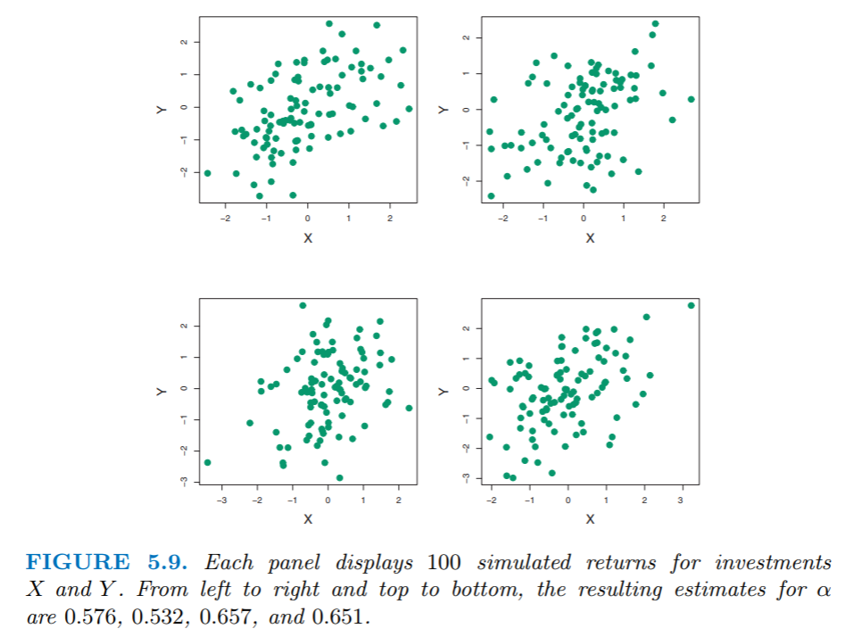
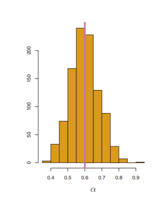
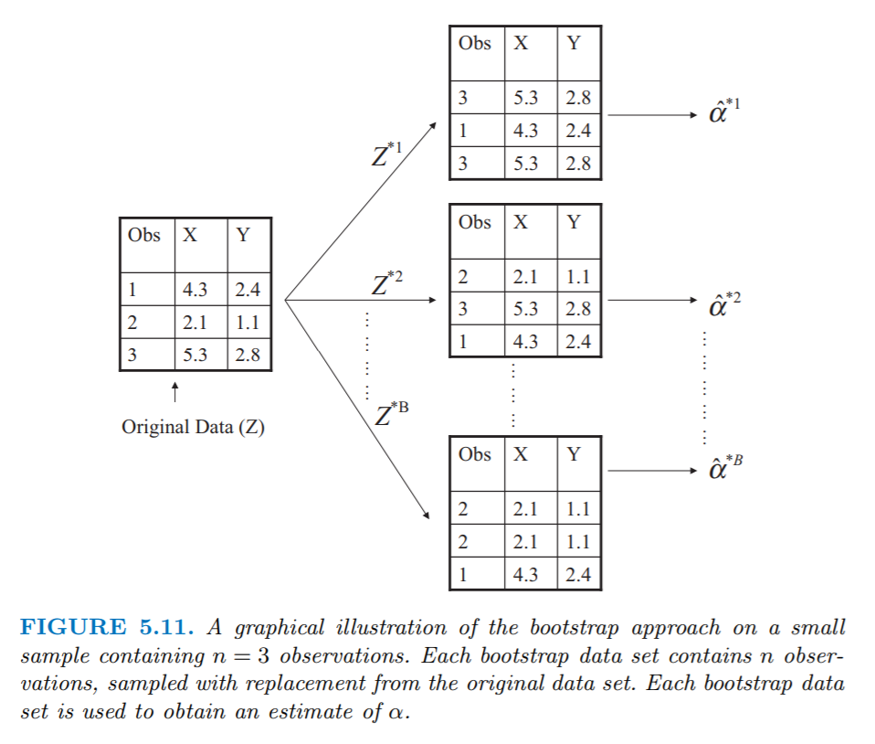

The Bootstrap
========================================================
author: Chloe Mirzayi
date: 2018.01.02
autosize: true

Topics
========================================================

- Introducing the bootstrap
- How to bootstrap
- Bootstrap in R

What is the bootstrap?
========================================================

- Extremely powerful statistical tool to quantify uncertainty
- Can be applied to a variety of estimators and methods
- Useful when variability is otherwise difficult to assess

Example (without bootstrap)
========================================================

- Imagine we want to invest in two companies X and Y
- We invest a fraction of our money ($\alpha$) in X and the rest (1 - $\alpha$) in Y 
- We want to minimize risk (i.e. variance) of our investment: $Var({\alpha}X + (1 − \alpha)Y )$

The formula for minimizing risk is:

$\alpha = \frac{\sigma^2_Y - \sigma_{XY}}{\sigma^2_X+\sigma^2_Y-2\sigma_{XY}}$

Where $\sigma^2_X=Var(X)$, $\sigma^2_Y=Var(Y)$, and $\sigma_{XY}=Cov(X,Y)$

Example (cont.)
========================================================

In reality, we don't know $\sigma^2_X$, $\sigma^2_Y$, and $\sigma_{XY}$; however, we can estimate $\hat{\sigma}^2_X$, $\hat{\sigma}^2_Y$, and $\hat{\sigma}_{XY}$. Using a dataset of past measurements of X and Y we estimate the value of $\alpha$ with minimal variance using:

$\hat{\alpha} = \frac{\hat{\sigma}^2_Y - \hat{\sigma}_{XY}}{\hat{\sigma}^2_X+\hat{\sigma}^2_Y-2\hat{\sigma}_{XY}}$


Example (cont.)
========================================================
We can simulate 100 pairs of returns on our investments in X and Y. Using these returns, we can estimate $\sigma^2_X$, $\sigma^2_Y$, and $\sigma_{XY}$.



Plugging these into this equation we can estimate $\alpha$.

Example (cont.)
========================================================
- We can average estimates for $\alpha$ from 1,000 samples:
$\bar{\alpha} =\frac{1}{1,000}\sum_{r=1}^{1,000}\hat{\alpha}_r = 0.5996$
- The result is very close to the actual $\alpha$ = 0.6
- We can also look at the standard deviation of the estimates:
$\sqrt{\frac{1}{1,000}\sum_{r=1}^{1,000}(\hat{\alpha}_r-\bar{\alpha})^2} = 0.083$

Example (cont.)
========================================================
- A histogram of the 1,000 simulations with the true value of $\alpha$ shown as a red line:

- However, this simulation was done by generating new samples from a set population
- We can't do this in reality
- Instead we can use the bootstrap approach to emulate this process

Bootstrap Process
========================================================
- Dataset $Z$ with sample size $n$
- Randomly sample $n$ observations from $Z$ with replacement
- Repeat this process $B$ times (where $B$ is some large number)
- Result: many bootstrap datasets (denoted as $Z^{*1}$ through $Z^{*B}$) and many estimates of $\alpha$ (denoted as $\hat{\alpha}^{*1}$ through $\hat{\alpha}^{*B}$)
- And using all these bootstrap datasets we can calculate a standard error:
$SE_B(\hat{\alpha}) = \sqrt{\frac{1}{B - 1}\sum_{r=1}^B(\hat{\alpha}^{*r}-\frac{1}{B}\sum_{r'=1}^B\hat{\alpha}^{*r'})^2}$

Bootstrap Process
========================================================
- Illustration of the bootstrap approach:


Assessing how well bootstrap works
========================================================


Example in R
========================================================

```r
library(ISLR)
library(boot)
set.seed(1)
alpha.fn=function (data ,index){
  X=data$X[index]
  Y=data$Y[index]
  return ((var(Y)-cov(X,Y))/(var(X)+var(Y) -2*cov(X,Y)))
  }
alpha.fn(Portfolio ,1:100)
```

```
[1] 0.5758321
```
Example in R: 1 Bootstrap Dataset
========================================================
We can take a sample (with replacement) equal to the sample size. This is the equivalent  of creating 1 bootstrap dataset:

```r
alpha.fn(Portfolio, sample(100, 100, replace=T))
```

```
[1] 0.5963833
```

Example in R: Bootstrap
========================================================
Now we can use the $boot$ function to generate an estimate of $\alpha$ using 1,000 bootstrap datasets:

```r
boot(Portfolio, alpha.fn, R=1000)
```

```

ORDINARY NONPARAMETRIC BOOTSTRAP


Call:
boot(data = Portfolio, statistic = alpha.fn, R = 1000)


Bootstrap Statistics :
     original        bias    std. error
t1* 0.5758321 -7.315422e-05  0.08861826
```

Example 2 in R
========================================================


```r
boot.fn=function (data ,index) + 
  return(coef(lm(mpg∼horsepower ,data=data , subset=index)))
boot.fn(Auto ,1:392)
```

```
(Intercept)  horsepower 
 39.9358610  -0.1578447 
```


```r
boot.fn(Auto, sample (392,392, replace=T))
```

```
(Intercept)  horsepower 
 39.4404609  -0.1536114 
```
Bootstrap Example
========================================================

```r
boot(Auto ,boot.fn ,1000)
```

```

ORDINARY NONPARAMETRIC BOOTSTRAP


Call:
boot(data = Auto, statistic = boot.fn, R = 1000)


Bootstrap Statistics :
      original        bias    std. error
t1* 39.9358610  0.0141555746 0.870373847
t2* -0.1578447 -0.0002819024 0.007533264
```

Bootstrap Example
========================================================
Compare our bootstrap estimates ($SE_{int}=0.862$, $SE_{hp}=0.007$) to linear model results:

```r
summary(lm(mpg∼horsepower ,data=Auto))$coef
```

```
              Estimate  Std. Error   t value      Pr(>|t|)
(Intercept) 39.9358610 0.717498656  55.65984 1.220362e-187
horsepower  -0.1578447 0.006445501 -24.48914  7.031989e-81
```

Bootstrap Example Take 2
========================================================


```r
boot.fn=function(data ,index) + coefficients(lm(mpg∼horsepower +I(horsepower ^2),data=data , subset=index))
boot(Auto ,boot.fn ,1000)
```

```

ORDINARY NONPARAMETRIC BOOTSTRAP


Call:
boot(data = Auto, statistic = boot.fn, R = 1000)


Bootstrap Statistics :
        original        bias     std. error
t1* 56.900099702 -3.078932e-02 2.1193694668
t2* -0.466189630  5.358284e-04 0.0339989578
t3*  0.001230536 -1.791806e-06 0.0001233926
```

Bootstrap Example Take 2
========================================================

```r
summary(lm(mpg∼horsepower +I(horsepower ^2),data=Auto))$coef
```

```
                    Estimate   Std. Error   t value      Pr(>|t|)
(Intercept)     56.900099702 1.8004268063  31.60367 1.740911e-109
horsepower      -0.466189630 0.0311246171 -14.97816  2.289429e-40
I(horsepower^2)  0.001230536 0.0001220759  10.08009  2.196340e-21
```
Compare to bootstrap estimates: $SE_{int}=2.088$, $SE_{hp}=0.033$, $SE_{hp^2}=0.0001$

In Summary
========================================================
- The bootstrap process is a powerful method for estimating uncertainty
- The $boot$ function in R is flexible and relatively easy to use

Exercises
========================================================
- 5.4.6 (page 199)
- 5.4.9 (page 201)
