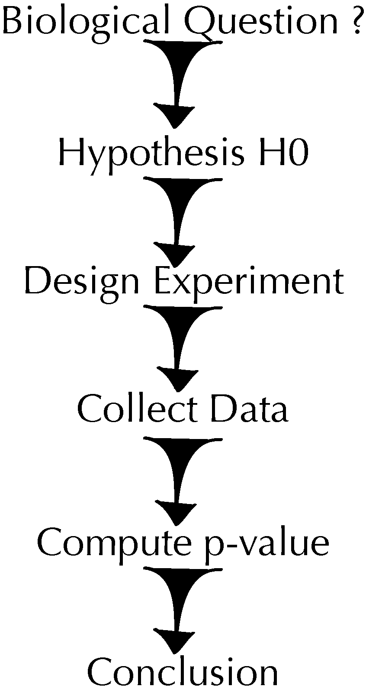

```{r setup, include=FALSE}
knitr::opts_chunk$set(dev = "png", dpi = 300, fig.margin = TRUE, fig.show = "hold", fig.keep = "none", fig.height = 2)
```

## Welcome

**Modern Statistics for Modern Biology** by Susan Holmes and Wolfgang Huber

http://web.stanford.edu/class/bios221/book/introduction.html

## Two instances of modern in the title

* **Biology**
    - formerly a science with sparse, often only qualitative data
    - now: production of quantitative data is on par with high energy physics or astronomy, but more more heterogeneous and complex.

```{r wringingflood, eval = TRUE, echo = FALSE, fig.show = 'hold', fig.keep = 'high', fig.height=6}
knitr::include_graphics(c('images/WringingFlood.png'))
```

## Two instances of modern in the title

* **Statistics**
    - formerly an application ground for probability theory and calculus, often taught loaded with notation and perceived with a heavy emphasis on hypothesis testing

```{r fisherparadigm, eval = TRUE, echo = FALSE, fig.show = 'hold', fig.keep = 'high', fig.height=2, fig.cap="The hypothesis testing paradigm recommended by R.A. Fisher starts with the formulation of a null hypothesis and the design of an experiment before the collection of any data. We could think in a similarly schematic way about model fitting -- just replace *Hypothesis H0* by *Parametric Model* and *Compute p-value* by *Fit Parameters*."}

```

## Two instances of modern in the title

* **Statistics**
    - formerly an application ground for probability theory and calculus, often taught loaded with notation and perceived with a heavy emphasis on hypothesis testing
    - now: EDA, visualization, resampling, simulations, pragmatic Bayesian/frequentist hybrids

```{r iterativeparadigm, eval = TRUE, echo = FALSE, fig.show = 'hold', fig.keep = 'high', fig.height=2, fig.cap="JW Tukey recommended starting any analysis with the data and wrote: 'No catalogue of techniques can convey a willingness to look for what can be seen, whether or not anticipated.'"}
knitr::include_graphics(c('images/iterativeparadigm.png'))
```


## Aims of this book

* **yes**: 
    - quickly bring scientists working in biological research up to speed on ideas and methods
    - hands-on approach: driven by classes of questions or data types. Methods and theory are introduced on a need-to-know basis. 

* **no**
    - systematically deduce from first principles
    - replace systematic training in underlying theory: probability, linear algebra, computer science, databases, multivariate statistics.
    
## The challenge: heterogeneity

* biological systems composed of tens of thousands of components, which can be in different states and interact in multiple ways. 
* *Modern biology* includes  comprehensive (high-dimensional) data in their temporal and spatial context. 
* *Modern biology* also includes complexities and heterogeneities of the data we collected by imperfect instruments.
* **Examples**:
    - nucleic acid and protein sequences, rectangular tables of counts, multiple tables, continuous variables, batch factors, phenotypic images, spatial coordinates, ...
    - clinical data, longitudinal information, environmental measurements, networks, lineage trees, annotation from biological databases in free text or controlled vocabularies, ...

## What’s in this book?

* exploratory data analysis (EDA)
* confirmatory data analyses (CDA)
* large-`p` small-`n` problem
    - *"sparsity principle"* -> assumption that most parameters are zero (or close to it)
    - *regularization* -> methods of modeling that include this assumption
    - *empirical Bayes* -> most parameters are the same or similar
* *simulations* -> to liberate us from worrying about assumptions, analytical feasibility

## What’s in this book?

* *generative models* -> simple models for the data generated (Chapter 1)
    - examples from immunology and DNA analysis to describe useful generative models for biological data: binomial, multinomial and Poisson random variables.
* *"bottom-up approach"*: given some data, what model is most likely able to explain it? (Chapter 2)
* Graphics with `ggplot2` (Chapter 3)
* Mixture models (Chapter 4)
* Clustering (Chapter 5)
* (Multiple) hypothesis testing (Chapter 6)
* Principal component analysis (Chapter 7)
* ANOVA and models for count data (Chapter 8)
* Multiple data types (Chapter 9)
* Networks and phylogenetic trees (Chapter 10)
* Images and spatial statistics (Chapter 11)
* Statistial learning (classification / machine learning) (Chapter 12)
* Good practices in the design of experiments and of data analyses (Chapter 13)

Also, R code and data files for all examples.

## Computational tools for modern biologists

* R/Bioconductor - many examples given of why
* *base R* (chapters 1-2)
* `gpplot2` (chapter 3)
* `dplyr`, `tibble` (4+)
    