```{r setup, include=FALSE}
knitr::opts_chunk$set(echo = FALSE, warning = FALSE, error = F, message = F)
```

# Introduction
* One of main challenges of biological data analysis: dealing with **hetereogeneity**.
* Model in the following figure (from chapter 2) can be seen as a mixture of *two* components.
* **Finite mixtures**.

```{r echo=FALSE, out.width="35%"}
library(knitr)
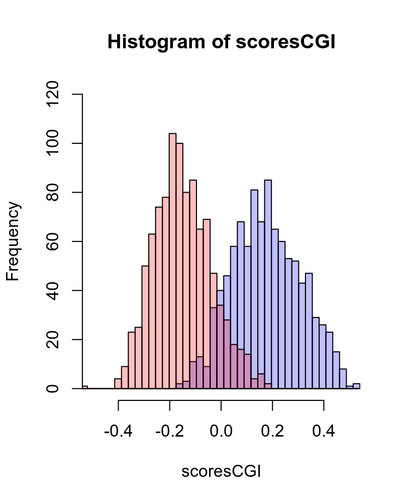
```

* Mixtures which consist of almost as many components as there are observations: **infinite mixtures**.
* Simple models often not appropriate to fit heterogeneous data, but can serve as "building blocks".

# 4.2 Finite mixtures
## 4.2.1 Simple examples and computer experiments

* *First exmaple:* Flip a fair coin. Two equal-sized components (fair mixture of two normals):
1. random number from a normal distribution with mean = 1 and variance = 0.25;
2. random number from a normal distribution with mean = 3 and variance = 0.25.

```{r echo=FALSE, out.width="35%"}
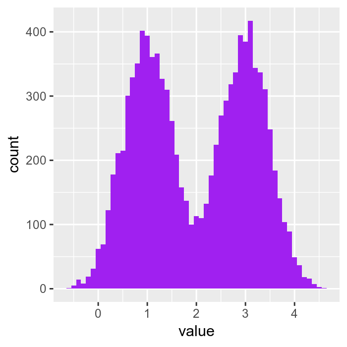
```

* Limiting curve (density function): $$f(x) = \frac{1}{2} \Phi_1(x) + \frac{1}{2}\Phi_2(x),$$ where $\Phi_1 = \mathcal N(\mu_1=1, \sigma^2=0.25)$, $\Phi_2 = \mathcal N(\mu_2=3, \sigma^2=0.25)$.
* Mixture model clearly visible due to lack of overlap (bimodal).
* Counterexample (*hidden groupings* in the center and right figure in purple):

```{r echo=FALSE, out.width="33%"}
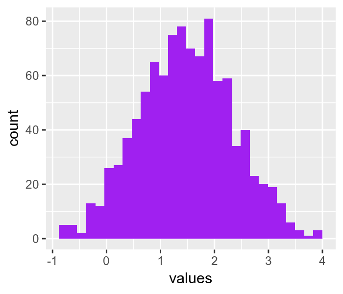
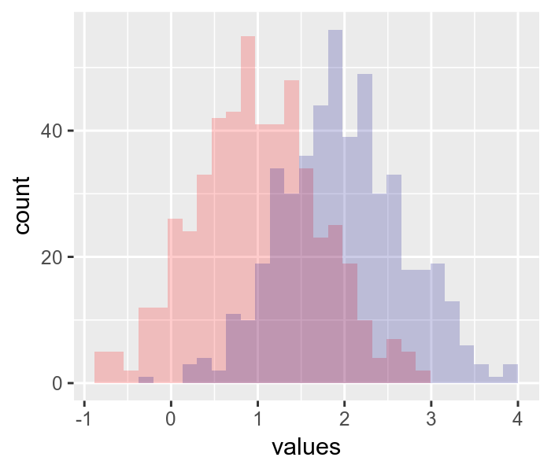
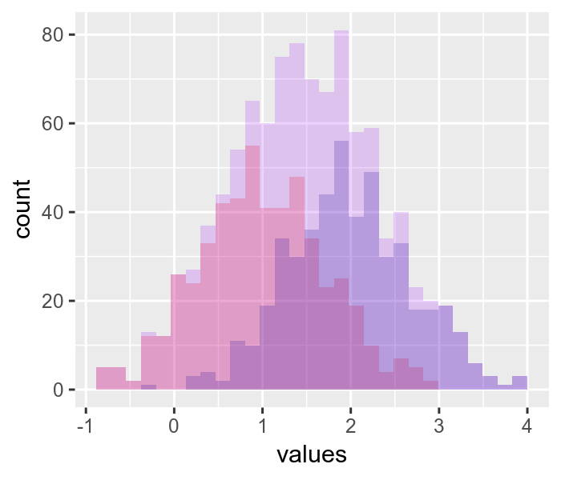
```

## 4.2.2 Discovering the hidden labels

* Use of **expectation maximization** (EM) algorithm to infer the value of the hidden groupings.
* Alternation between two steps:
    1. Pretend to know the probability with which each observation belongs to a component and  
estimate the distribution parameters of the components;
    2. Pretend to know the parameters of the component distributions and  
estimate the probability with which each observation belongs to the components.  
$\Rightarrow$ alternating between solving simpler problems!
* *Example:* (superficial) We measure a variable $Y$ on a series of objects that we think came from two groups  
without knowing the actual group labels  
We start by augmenting the data with the unobserved (*latent*) group label $U$.  
We are interested in finding
    + the values of $U$ and
    + the unknown parameters of the underlying densities $(\theta = (\mu_1,\mu_2,\sigma_1,\sigma_2,\lambda))$,  
where $\lambda$ represents the mixture fraction/proportions.
* We use the *maximum likelihood* approach to estimate the aforementioned parameters that make the data $Y$ most likely:  
$f_{\theta}(y,u)=f_{\theta}(y \mid u) \cdot f_{\theta}(u).$
* *Mixture of normals:* Two normals ($\mu_1 = ?$, $\mu_2 = ?$, $\sigma_1=\sigma_2=1$), labels $u$.  
If we know the labels (not the case in reality), we can estimate $\mu_1$ and $\mu_2$ by means of seperate MLEs for each of the two groups. Overall MLE is obtained by maximizing
$$f(y,u \mid \theta) = \prod_{\{i \colon u_i=1\}}{\Phi_1(y_i)} \prod_{\{i \colon u_i=2\}}{\Phi_2(y_i)}$$
or its logarithm.

* Maximization can be split into two different pieces and solved as if we had two different MLEs to find.
* As mentioned before: $u$ lables and mixture proportions $\lambda$ unknown in reality.
* Start with *initial guess* for the labels,  
estimate the parameters and  
go through several iterations of the algorithm, updating at each step our current best guess of the group labels *and* the parameters  
until we see no substantial improvement in our optimizations any more.
* But we can do something more elaborate. Replace the "hard" labels $u$ (groups 1 and 2) for each observation by *membership probabilities* that sum up to 1.
* $p(u,x \mid \theta)$ serves as a weight or "participation" of observation $x$ in the likelihood function.
* **Marginal likelihood** for the observed $y$ is the *sum over all possible values of u* of the densities at $(y,u)$: $$\operatorname{marglike}(\theta;y) = f(y \mid \theta) = \sum_u{f(y,u \mid \theta)}.$$
Let $\mbox{}\;\ldots^*$ mark the current best guess.
* At each iteration the current best guess for the unknown paramters are combined into  
$\theta^* = (\mu_1^*, \mu_2^*, \lambda^*)$.
* We use these to compute the so-called **E**xpecatation function $E^*(\theta)$:
$$E^*(\theta) = E_{\theta^*,Y}[\log p(u,y \mid \theta^*)] = \sum_u{p(u \mid y, \theta^*)\log p(u,y \mid \theta^*)}.$$
* Value of $\theta$ that maximizes $E^*$ is found in what is known as the **M**aximization step.
* These two iterations (E, M) are repeated until improvements are small.

## 4.2.3 Models for zero inflated data
[omitted for reasons of time]

## 4.2.4 More than two components

*Example:* $N=7{,}000$ nucleotide mass measurements with four components (adenine, cytosine, guanine, thymine) each.

```{r echo=FALSE, out.width="40%"}
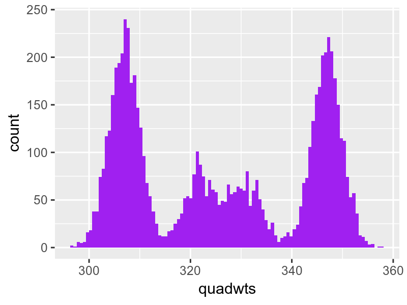
```

* With fewer and/or more noisy measurements the four modes and the distribution components might be less clear.

# 4.3 Empirical distributions and the nonparametric bootstrap

* Consider an extreme case of mixture models, where we model our sample of $n$ data points as a mixture of $n$ *point masses*.

```{r echo=FALSE, out.width="40%"}
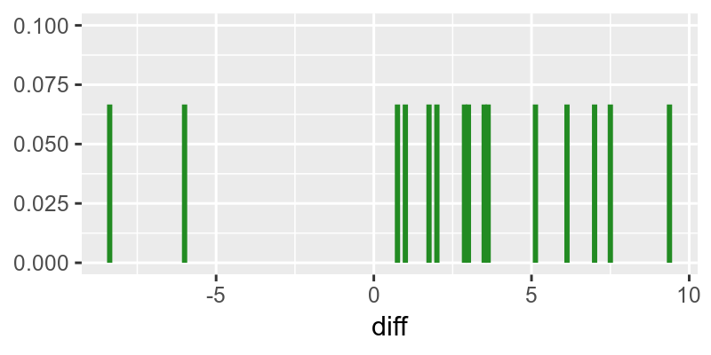
```

* **Empirical cumulative distribution function** (ECDF) for a sample of size $n$: $$\hat F_n(x) = \frac{1}{n}\sum_{i=1}^n{1_{x_i \leq x}}.$$
* **Density function** of our sample: $$\hat f_n(x) = \frac{1}{n}\sum_{i=1}^n{\delta_{x_i}(x)}.$$
* Statistics of our sample can now be written as a function of the ECDF, e.g., $$\bar x = \int{\delta_{x_i}(x) \mathrm dx}.$$
* Different samples from a distribution function $F$ lead to different values of the estimate $\hat\tau$ of a *statistic* $\tau$  
$\rightarrow$ **sampling variability**.
* Distribution of all these $\hat\tau$'s: **sampling distribution**.

* **Bootstrap** principle approximates the true sampling distribution of $\hat\tau$.
* Original sample $\rightarrow$ empirical distribution $\rightarrow$ new samples of the same size $(=:n)$.
* Each of the $n$ values of each sample is a component of the $n$-component mixture.
* Draws are performed *with replacement* $\Rightarrow$ different $\hat\tau$'s.
* I.e., the bootstrap simulates the sampling variability by drawing samples not from the underlying true distribution $F$, but from the empirical distribution function $\hat F_n$.

```{r echo=FALSE, out.width="40%"}
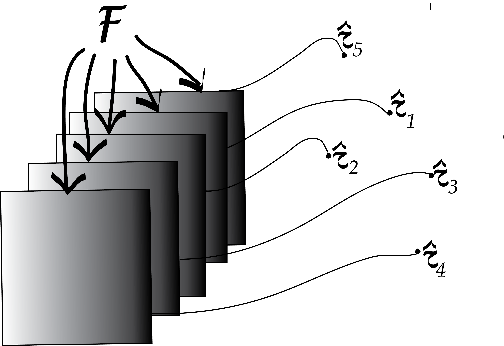
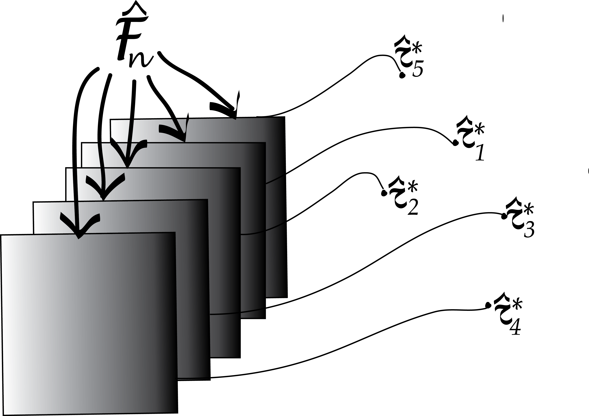
```

# 4.4 Infinite mixtures

If the number of mixture components is as big as the number of observations (or even bigger), we call this an **infinite mixture**.

## 4.4.1 Infinite mixture of normals

* Let's look at the following R code (*Laplace distribution*):  
w = rexp(10000, rate = 1)  
lps = rnorm(length(w), mean = 0.3, sd = sqrt(w))  
$\rightarrow$ 10,000 observations, mean fix, different standard deviations.

```{r echo=FALSE, out.width="40%"}
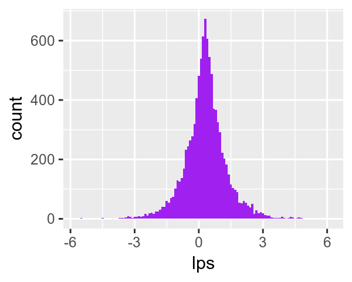
```

* *Asymmetric Laplace distribution*:  
different means *and* standard deviations.

```{r echo=FALSE, out.width="40%"}
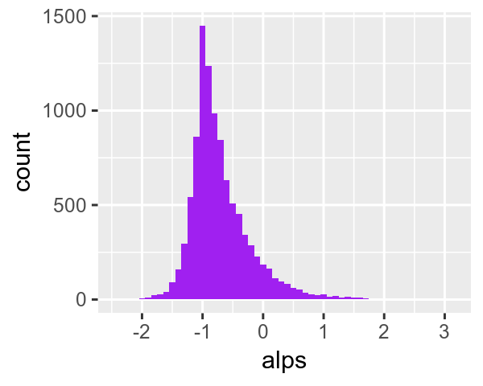
```

## 4.4.2 Infinite mixtures of Poisson variables

* Simliar two-level hierarchical model often needed to model real-world count data.
* Simple Poisson and binomial distributions may serve as building blocks, but  
their parameters may depend on some underlying (*latent*) process.
* *Example:* Fish abundance in lakes.  
Rate parameters $\lambda$ can be modeled as coming from a distribution of rates.

## 4.4.3 Gamma distribution: two parameters (shape and scale)

* $\Gamma$-distribution generalization of the exponential distribution.
* *Example:* $\Gamma$-Poisson mixture (also known as *negative binomial distribution*).
1. Generate a set of parameters $\{ \lambda_1, \lambda_2,\ldots \}$ from a $\Gamma$-distribution.
2. Use these to generate a set of Poisson ($\lambda_i$) random variables, one for each $\lambda_i$.

```{r echo=FALSE, out.width="40%"}
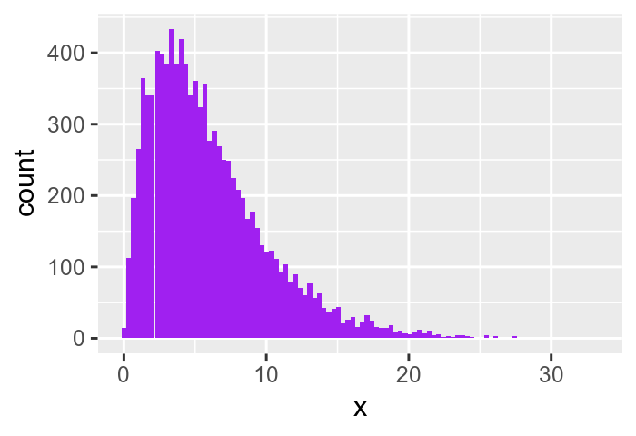
```

## 4.4.4 Variance stabilizing transformations

* Question: How much variability is there between *repeated measurements* of the same underlying true value, i.e. between replicates?
* This will determine whether and how well we can see any *true differences*, i.e. between *different conditions*.
* *Example:* $\sqrt{}$-transformation:

```{r echo=FALSE, out.width="40%"}
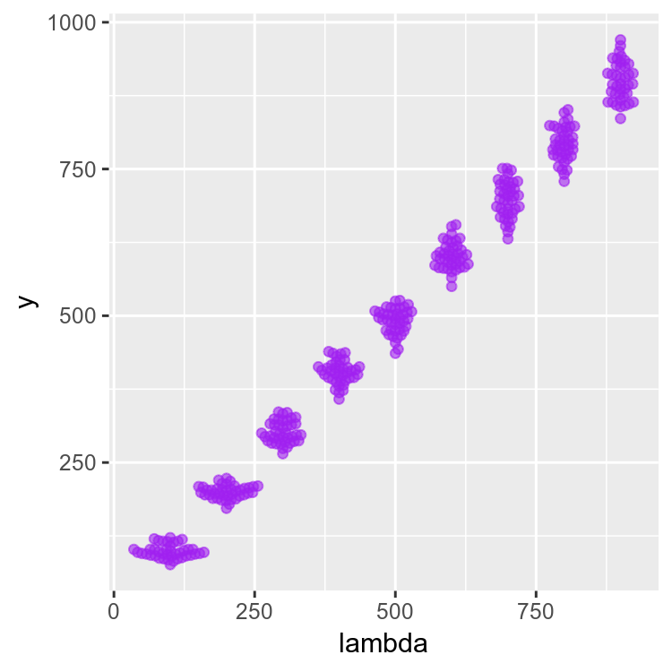
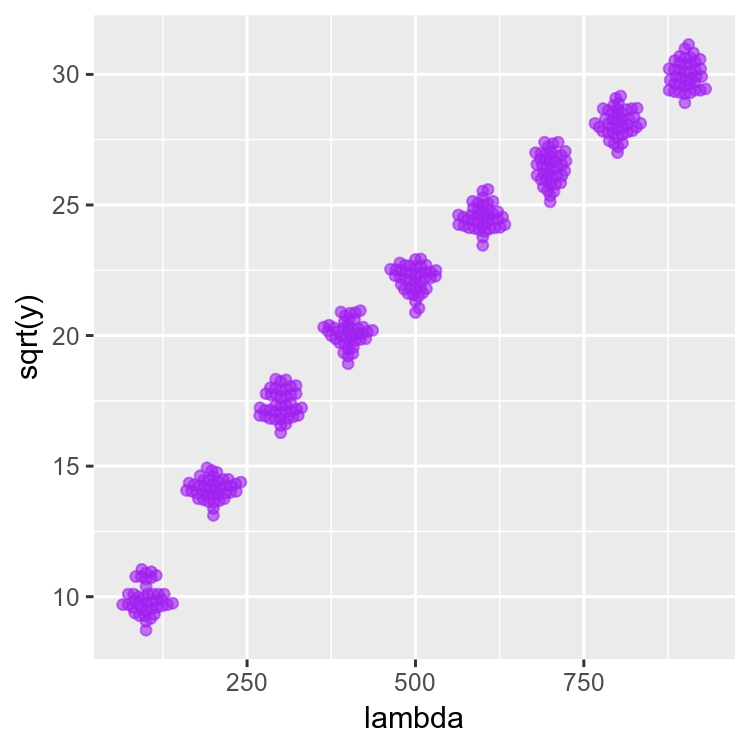
```

* Shapes of the beeswarm clouds change on the left, but less so on the right.
* Term **heteroscedasticity:** standard deviations (variance) of our data are different in different regions of our data space.

## Exercise for homework
* **Exercise 4.1** -- the *expectation maximization* step by step.  
Study the R code and answer some questions.