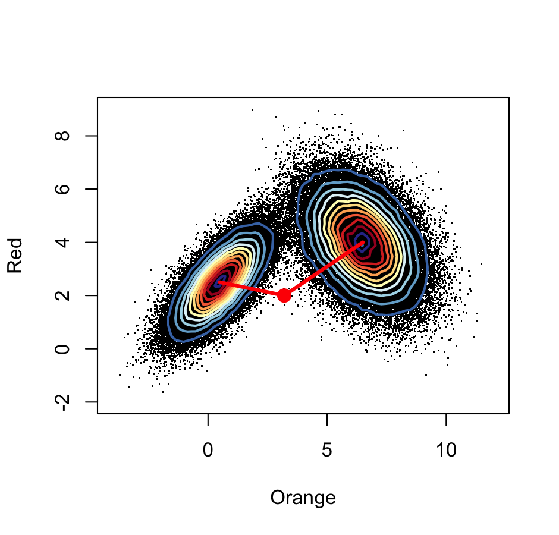

```{r, include=FALSE}
library(plotly)
```

# Clustering Overview

- Takes data (continuous or quasi-continuous) and adds to them a new categorical group variable

- Can assist in simplifying decision making, but comes at a cost of ignoring intermediate states

- caveat: clustering algorithms are designed to find clusters, so they will find clusters, even where there are none
  
  - cluster validation is an essential component of our process, especially if there is no prior domain knowledge that supports the existence of clusters.

---
# How do we measure similarity

- Decide what we mean by similar (e.g. similar by height or similar by habitat)

- Chose how to combine features into a single number

  - Do they have to be in the same scale?
  
- Mathematical notation distance between two points $A=(a_1,...,a_p)$ and $B= (b_1,...,b_p)$ in $p$ dimensionsal space. 

---
# Which of the two cluster centers is the red point closest to?



---

# Test Data

```{r, comment='#'}
test <- data.frame("x" = c(0,0,0,1,1,1), 
                   "y" = c(1,0,1,1,0,1), 
                   "z" = c(1,1,1,0,1,1))

test
```

- 6 points $A$, in 3 dimensions $p$

---
# Parameters to dist() Function
```{r, comment='#'}
# to use less space than n^2 positions, 
# by default returns only lower triangle
dist(test)
```

```{r, eval = FALSE}
# by default "euclidian" method
dist(test)

# also accepts, euclidean", "maximum", "manhattan", "canberra", "binary" or "minkowski"

dist(test, method = "binary")
```

---
# Full Similarity Matrix
```{r}
dist(test, diag = TRUE, upper = TRUE)
```

- Note 0 perfectly similar
---
# Computations related to distance in R Types
```{r, warning=FALSE, message=FALSE}
plot_ly(test, x = ~x, y = ~y, z = ~z, 
        color = rownames(test))
```

---
# Euclidean Similarity

\begin{equation*}
d(A,B)=\sqrt{(a_1-b_1)^2+(a_2-b_2)^2+... +(a_p-b_p)^2}
\end{equation*}

- is the square root of the sum of squares of the differences in all $p$ coordinate directions, also called L2
```{r}
dist(test)
```

---

# Euclidean Distance (simple example)
```{r}
#example
example_1 <- data.frame(x=c(2,6), y=c(4,6))
example_1
```

```{r, echo=FALSE, fig.align="center", fig.height = 5, fig.width = 5}
plot(example_1,pch=19)
```

---
# Euclidean Distance (simple example)

```{r, echo=FALSE, fig.align="center", fig.height = 5, fig.width = 5}
plot(example_1,pch=19)
#lines is in the format (x1, x2) (y1, y2)
lines(c(example_1[1,1],example_1[2,1]),c(example_1[1,2],example_1[2,2]))

```

```{r}
dist(example_1)
```

---
# Maximum Distance

\begin{equation*}
d_\infty(A,B)= \max_{i}|a_i-b_i|.
\end{equation*}

- The maximum of the absolute differences between coordinates is also called the L $_\infty$ distance:

```{r}
dist(test, method = "maximum")
```

---
# Maximum Distance (simple example)
```{r}
dist(example_1, method = "maximum")
```


```{r, echo=FALSE, fig.align="center", fig.height = 5, fig.width = 5}
plot(example_1,pch=19)
#lines is in the format (x1, x2) (y1, y2)
lines(c(example_1[1,1],example_1[2,1]),c(example_1[1,2],example_1[1,2]))
```

---

# Manhattan Distance

\begin{equation*}
d(A,B)=|a_1-b_1|+|a_2-b_2|+... +|a_p-b_p|.
\end{equation*}

- The Manhattan, City Block, Taxicab or L1 distance takes the sum of the absolute differences in all coordinates

```{r}
test[1:3,]
dist(test, method = "manhattan")
```

---
# Weighted Euclidean Distance

- Generalization of the ordinary Euclidean distance, by giving different directions in feature space different weights

- Mahalanobis distance is a Euclidean distance that takes into account the fact that different features may have a different dynamic range, and that some features may be positively or negatively correlated with each other. The weights in this case are derived from the covariance matrix of the features.


---

# Minkowski Distance

\begin{equation}
d(A,B) = \left( (a_1-b_1)^m+(a_2-b_2)^m+... +(a_p-b_p)^m \right)^\frac{1}{m}.
\end{equation}

- Generalization allowing the exponent to be m 
- If m = 1, same as manhattan
- If m = 2, same as euclidian

```{r, eval=FALSE}
dist(test, method = "minkowski", p = 1.5)
```


---

# Hamming Distance

- This distance is the simplest way to compare character sequences. 

- It simply counts the number of differences between two character strings

- "AAGGCC**TT**" vs "AAGGCC**AA**" = 2 

```{r, message=FALSE}
library(Biostrings)
stringDist(c("AAGGCCTT", "AAGGCCAA"), method = "hamming")
```

---

# Binary Distance

- non-zero elements treated as ‘on’ and the zero elements as ‘off’

- computes the proportion of features having only one bit on amongst those features that have at least one bit on

```{r}
x <- c(0, 0, 1, 1, 1, 1)
y <- c(1, 0, 1, 1, 0, 1)
# answer = 2/5
dist(rbind(x, y), method = "binary")

x <- c(1, 1, 1, 1, 1, 1)
y <- c(0, 0, 0, 0, 0, 0)
# answer = 6/6
dist(rbind(x, y), method = "binary")


```

---

# Jaccard Index

\begin{equation}
J(S,T) = \frac{f_{11}}{f_{01}+f_{10}+f_{11}},
\end{equation}

- Occurrence of traits or features can be translated into presence and absence and encoded as 1’s and 0’s
- Use if co-existence is more important than co-absence (e.g. mutation patterns)
- $f_{11}$ = the number of times a feature co-occurs in S and T
- $f_{10}$ and $f_{01}$  the number of times a feature occurs in S but not in T (and vice versa)
- $f_{00}$ he number of times a feature is co-absent
- dissimilarity is simply 1 - Jaccard Index

```{r}
s <- c(0,0,1,1,1,1)
t <- c(1,0,1,1,0,1)
# similarity 
3 / (1 + 1 + 3)
```

---

# Jaccard Distance Example
```{r}
mut <- read.csv("data/HIVmutations.csv")
dim(mut)

mut[1:3, 10:16]
```

---
# Jaccard Distance Example
```{r message=FALSE, warning=FALSE}
library(vegan)
vegdist(mut, meto = "jaccard")
```

```{r}
as.dist(sqrt(2 * (1 - cor(t(mut)))))
```

---

# Non-numeric Feature Space
- General dissimilarity coefficient of Gower you are able to handle other variable types as well (e.g. nominal, ordinal, (a)symmetric binary) even when different types occur in the same data set.

- The dissimilarity between two rows is the weighted mean of the contributions of each variable
```{r}
library(cluster)
library(ggplot2)
head(diamonds)
```

---

# Gower Dissimilarity

```{r}
daisy(head(diamonds), metric = "gower")
```

---
# When to scale
- If variables are not scaled
  - variable with largest range has most weight
  - distance depends on scale 
  
- Scaling gives every variable equal weight
- Scale if,
  - variables measure different units (kg, meter, sec,…)
  - you explicitly want to have equal weight for each variable
---

# Nonparametric mixture detection
- Work well in high-dimensional settings, where we cannot easily use probability densities, the EM algorithm and parametric mixture

- Besides the distance measure, the main choice to be made is the number of clusters 
k

- The centers of the groups are sometimes called medoids, thus the name PAM (partitioning around medoids)

---

# Steps in PAM

1. Starts from a matrix of p features measured on a set of n observations.

2. Randomly pick k distinct cluster centers out of the n observations (“seeds”).

3. Assign each of the remaining observation to the group to whose center it is the closest.

4. For each group, choose a new center from the observations in the group, such that the sum of the distances of group members to the center is minimal; this is called the medoid.

5. Repeat Steps 3 and 4 until the groups stabilize.
---

# PAM vs k-means

- k-means replaces the medoids by the arithmetic means (centers of gravity) of the clusters

- In PAM, the centers are observations, this is not, in general, the case with k-means.

- Both work well when the clusters are of comparable size and convex (blob-shaped)

- Poor performance if the true clusters are very different in size, the larger ones will tend to be broken up; or they have pronounced non-spherical or non-elliptic shapes.
---

# Tight clusters with resampling

- Repeating a clustering procedure multiple times on the same data, but with different starting points creates strong forms

- Repeated subsampling of the dataset and applying a clustering method will result in groups of observations that are “almost always” grouped together; these are called tight clusters 

---

# Question 5.4
```{r message=FALSE, warning=FALSE}
library(clusterExperiment)
library(scRNAseq)
library(SummarizedExperiment)
data("fluidigm", package = "scRNAseq")

assay(fluidigm)[1:5,1:5]

NROW(fluidigm) # number of genes

```

---

# Sample Metadata
```{r}
SummarizedExperiment::colData(fluidigm)[,1:5]

NCOL(fluidigm) #number of samples

```

---
# Filtering and Normalization

```{r}
# limit the analysis to the samples corresponding to high sequencing depth
se <- fluidigm[,colData(fluidigm)[,"Coverage_Type"]=="High"]

# retain only those genes with at least 10 reads in at least 10 cells.
wh_zero <- which(rowSums(assay(se))==0)
pass_filter <- apply(assay(se), 1, function(x) length(x[x >= 10]) >= 10)
se <- se[pass_filter,]
dim(se)
```

```{r}
# quantile normalization 
fq <- round(limma::normalizeQuantiles(assay(se)))
assays(se) <- list(normalized_counts=fq)
```

```{r}
#update names
wh<-which(colnames(colData(se)) %in% c("Cluster1","Cluster2"))
colnames(colData(se))[wh]<-c("Published1","Published2")
```

---
# Perform Clustering
- Set the choice of genes to include at either the 60, 100 or 150 most variable genes. 

-Plot the clustering results for k varying between 4 and 9
```{r, message=FALSE, warning=FALSE, eval=FALSE}
ce = clusterMany(se, clusterFunction = "pam", ks = 5:10, run = TRUE,
  isCount = TRUE, reduceMethod = "var", nFilterDims = c(60, 100, 150))
clusterLabels(ce) = sub("FilterDims", "", clusterLabels(ce))
plotClusters(ce, whichClusters = "workflow", axisLine = -1)
```

---
# Cluster Plot (cell = column)

```{r, message=FALSE, warning=FALSE, echo= FALSE}
ce = clusterMany(se, clusterFunction = "pam", ks = 5:10, run = TRUE,
  isCount = TRUE, reduceMethod = "var", nFilterDims = c(60, 100, 150))
clusterLabels(ce) = sub("FilterDims", "", clusterLabels(ce))
plotClusters(ce, whichClusters = "workflow", axisLine = -1)
```

---
# Flow cytometry and mass cytometry

```{r, message=FALSE}
library("flowCore") 
library("flowViz")

fcsB = read.FCS("data/Bendall_2011.fcs") 

slotNames(fcsB)

# How many variables were measured?
head(colnames(fcsB))

# How many Cells Were Measures
dim(exprs(fcsB))
```

---
# Data preprocessing

```{r message=FALSE}
#match isotype name to marker name
markersB = readr::read_csv("data/Bendall_2011_markers.csv")
head(markersB)
mt = match(markersB$isotope, colnames(fcsB))
stopifnot(!any(is.na(mt)))
colnames(fcsB)[mt] = markersB$marker
```

---
# Clustering on One Marker 
```{r}
flowPlot(fcsB, plotParameters = colnames(fcsB)[2:3], logy = TRUE)
```

---
# Data Transformation

\begin{equation*}
\operatorname{asinh}(x) = \log{(x + \sqrt{x^2 + 1})}.
\end{equation*}

- for large values of x , asinh(x) behaves like the log

- for small x the function is close to linear in x

---

# Transformation Example
```{r}
library(patchwork)
v1 = seq(0, 1, length.out = 100)
v3 = seq(30, 3000, length = 100)
```

```{r, echo=FALSE, fig.height=5.5}
x <- as.data.frame(cbind(v1, v3))
p1 <- ggplot(x, aes(x = log(v1), y = asinh(v1))) +
  geom_line()

p2 <- ggplot(x, aes(x = v1, y = asinh(v1))) +
  geom_line()


p3 <- ggplot(x, aes(x = log(v3), y = asinh(v3))) +
  geom_line()

p1 + p2 + p3
```

```{r, include=FALSE}
asinhtrsf = arcsinhTransform(a = 0.1, b = 1)
fcsBT = transform(fcsB,
  transformList(colnames(fcsB)[-c(1, 2, 41)], asinhtrsf))
```

---

# One Dimensional Clustering
```{r}
# one dimensional k-means
kf = kmeansFilter("CD3all" = c("Pop1","Pop2"), filterId="myKmFilter")
fres = flowCore::filter(fcsBT, kf)
summary(fres)
```

---

# Two dims. plot by the CD3 and CD56 

```{r warning=FALSE, message=FALSE, fig.height=4}
library("flowPeaks")
fp = flowPeaks(Biobase::exprs(fcsBT)[, c("CD3all", "CD56")])
plot(fp)
```

---
# Use Contours and Shadding to Avoid Over Plotting

```{r, fig.height=5}
flowPlot(fcsBT, plotParameters = c("CD3all", "CD56"), logy = FALSE)
contour(fcsBT[, c(40, 19)], add = TRUE)
```

---

# Density Based Clustering
- looks for regions of high density separated by sparser regions
- advantage of being able to cope with clusters that are not necessarily convex

```{r, message=FALSE, warning=FALSE}
library("dbscan")
mc5 = Biobase::exprs(fcsBT)[, c(15,16,19,40,33)]
head(mc5, 3)

res5 = dbscan::dbscan(mc5, eps = 0.65, minPts = 30)
mc5df = data.frame(mc5, cluster = as.factor(res5$cluster))
# how many cells assigned to clluster
table(mc5df$cluster)
```

---

# Overlaping of contours highlights multidimensional nature of the clustering
```{r, echo = FALSE, fig.height=6}
p1 <- ggplot(mc5df, aes(x=CD4,    y=CD8,  col=cluster))+geom_density2d()
p2 <- ggplot(mc5df, aes(x=CD3all, y=CD20, col=cluster))+geom_density2d()
p1 + p2

```

