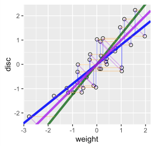
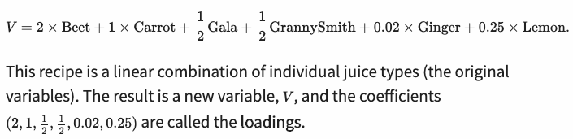
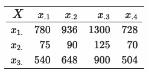

```{r setup, include=FALSE}
knitr::opts_chunk$set(echo = TRUE)
```

# Goals for this chapter

- Perform dimension reduction to understand correlations between variables.
- Preprocess, rescale and center the data before starting a multivariate analysis.
- Build new variables, called **principal components (PC)**, that are more useful than the original measurements.
- See what is “under the hood” of PCA: the **singular value decomposition** of a matrix.
- Visualize what this decomposition achieves and learn how to choose the number of principal components.

# Datasets used 
```{r echo=FALSE}
# set your own wd
wd = "~/Bioinfo/2019_BookClub/"
```

**1. Turtles**   
The last three columns are length measurements (in millimetres), whereas the first column is a factor variable that tells us the sex of each animal.
```{r}
turtles = read.table(file.path(wd, "data/PaintedTurtles.txt"), header = TRUE)
turtles[1:4, ]
```

<br>

**2. Athletes**   
It reports the performances for 33 athletes in the ten disciplines of the decathlon. (*weight* and *disc* are the lengths in meters the athletes were able to throw the weight and discus)
```{r}
load(file.path(wd, "data/athletes.RData"))
athletes[1:3, ]
```

# Preprocessing the data
_**Why Multivariate Analysis?**_   
to investigate connections or associations between the different variables 

_**Why Preprocessing?**_   
in many cases, different variables are measured in different units     

- **Centering** means subtracting the mean, so that the mean of the centered data is at the origin.    
- **Scaling** (or **standardizing**) means dividing by the standard deviation, so that the new standard deviation is 1.   

--> `scale()` function in R does this.   

# Dimension reduction
* 1901 invented by Karl Pearson: a way to reduce a two-variable scatterplot to a single coordinate    
* 1930s: providing overall scores that summarize many test-variables at once (principle scores --> PCA)  
* PCA is primarily an exploratory technique that produces maps that show the relations between variables and between observations in a useful way
* the correlation coefficient is the vector product of the centered and scaled variables --> In PCA, you split this correlation matrix into scale part (eigenvalues) and direction part (eigenvectors).

## Lower-dimensional projections
```{r echo=FALSE}
library(ggplot2)
library(ade4)
```

One way of projecting two-dimensional data onto a line
```{r Fig7.6, fig.width=4, fig.height=4}
athletes = data.frame(scale(athletes))
ath_gg = ggplot(athletes, aes(x = weight, y = disc)) +
  geom_point(size = 2, shape = 21)
ath_gg + geom_point(aes(y = 0), colour = "red") +
  geom_segment(aes(xend = weight, yend = 0), linetype = "dashed")
```

Here, we lose all the information about the disc variable.   
--> How to keep as much information as we can about both variables?   
--> **regression lines**

## How do we summarize two-dimensional data by a line?
Regression of the disc variable on weight   
: The blue line minimizes the sum of squares of the vertical residuals (in red).   

```{r Fig7.7, fig.width=4, fig.height=4}
reg1 = lm(disc ~ weight, data = athletes)
a1 = reg1$coefficients[1] # intercept
b1 = reg1$coefficients[2] # slope
pline1 = ath_gg + geom_abline(intercept = a1, slope = b1,
    col = "blue", lwd = 1.5)
pline1 + geom_segment(aes(xend = weight, yend = reg1$fitted),
    colour = "red", arrow = arrow(length = unit(0.15, "cm")))
```

Regression of weight on discus   
: The green line minimizes the sum of squares of the horizontal residuals (in orange).   

```{r Fig7.8, fig.width=4, fig.height=4}
reg2 = lm(weight ~ disc, data = athletes)
a2 = reg2$coefficients[1] # intercept
b2 = reg2$coefficients[2] # slope
pline2 = ath_gg + geom_abline(intercept = -a2/b2, slope = 1/b2,
    col = "darkgreen", lwd = 1.5)
pline2 + geom_segment(aes(xend=reg2$fitted, yend=disc),
    colour = "orange", arrow = arrow(length = unit(0.15, "cm")))
```

A line that minimizes distances in both directions   
: The purple principal component line minimizes the sums of squares of the orthogonal (perpendicular) projections. = principal componenet line  

```{r Fig7.9, fig.width=4, fig.height=4}
xy = cbind(athletes$disc, athletes$weight)
svda = svd(xy)
pc = xy %*% svda$v[, 1] %*% t(svda$v[, 1])
bp = svda$v[2, 1] / svda$v[1, 1]
ap = mean(pc[, 2]) - bp * mean(pc[, 1])
ath_gg + geom_segment(xend = pc[, 1], yend = pc[, 2]) +
  geom_abline(intercept = ap, slope = bp, col = "purple", lwd = 1.5)
```
  
<br>

**All our three ways of fitting a line together in one plot**    
<left>

</left>

```{r}
var(athletes$weight) + var(reg1$fitted)
var(athletes$disc) + var(reg2$fitted)
```

the variance along principle component axis is larger than the other variances we calculated above.
```{r}
sum(apply(pc, 2, var))
```


# The new linear combinations
The PC line from the previous example can be written like this.

$$
PC = \frac{1}{2}disc + \frac{1}{2}weight
$$

<br>

**Principal components** are *linear combinations* of the variables that were originally measured, providing a new coordinate system, and the *coefficients* are called the **loadings**.  

<br>

_**Analogy #1**_   




<br>

_**Analogy #2**_   
The principal component minimizes the distance to the line, and it also *maximizes* the variance of the projections along the line. Why maximizing the variance is good?

 

Generally, choosing the perspective such that the spread (in other words, the variance) of the points is maximal provides most information.

# The inner workings of PCA: rank reduction
* PCA is finding the axis showing the largest variability, removing the variability in that direction and then iterating to find the next best orthogonal axis so on. 
* Without iterations, all the axes can be found in one operation called the **Singular Value Decomposition (SVD)**.

## Rank-one matrices 
 {width=250px}

The decomposition of X is not unique: there are several candidate choices for the vectors *u* and *v*. 

1. Each vector has its coordinates' sum of squares add to 1   
2. Keep track of one extra number by 
    - which to multiply each of the products
    - which represents the “overall scale” of X (= singular value *s*1)
3. (this is following below...)   

{width=1000px}

<br>

_**Check the norm (1) and multiplication (2) properties**_   

```{r}
X = matrix(c(780,  75, 540,
             936,  90, 648,
            1300, 125, 900,
             728,  70, 504), nrow = 3)
u = c(0.8196, 0.0788, 0.5674)
v = c(0.4053, 0.4863, 0.6754, 0.3782)
s1 = 2348.2
```

```{r}
sum(u^2)
sum(v^2)
s1 * u %*% t(v)
```

<br>

**`svd()` in R**   
The returned value is a list with components:   

**d** a vector containing the singular values of x, sorted decreasingly   
**u** a matrix whose columns contain the left singular vectors of x   
**v** a matrix whose columns contain the right singular vectors of x   

```{r}
svd(X)
```

```{r}
# the correct answers!
u = c(0.8196, 0.0788, 0.5674)
v = c(0.4053, 0.4863, 0.6754, 0.3782)
s1 = 2348.2
```

SVD is finding horizontal and vertical vectors (called the singular vectors = *u* and *v*) and normalizing values (called singular values = the value in the upper left corner (*s*1) = *d*).

## How to decompose X when it is not of rank 1 
```{r}
Xtwo = matrix(c(12.5, 35.0, 25.0, 25, 9, 14, 26, 18, 16,
                21, 49, 32, 18, 28, 52, 36, 18, 10.5, 
                64.5, 36), ncol = 4, byrow = TRUE)
USV = svd(Xtwo)
USV$d
```

The third and fourth singular values are so small they do not improve the approximation, we can conclude that Xtwo is of rank 2.

Singular vector should be:  

1. Each vector has its coordinates' sum of squares add to 1   
2. One extra number by which to multiply each of the products, and which represents the “overall scale” of X (= singular value *s*1)   
3. Each vector in the *u* and *v* matrices is orthogonal to all the previous ones

<br>

**Check the orthgonality** 
```{r}
round(t(USV$u) %*% USV$u, 10)
round(t(USV$v) %*% USV$v, 10)
```

## Singular value decomposition (SVD)
X is decomposed additively into rank-one pieces. Each of the *u* vectors is combined into the *U* matrix, and each of *v* vectors into *V*. The *Singular Value Decomposition* is 
$$
X = USV^t, VV^t = I, UU^t = I
$$

S = the diagonal matrix of singular values   
$V^{t}$= the transpose of V   
I = the identity matrix   

U and V are said to be **orthonormal** (= orthogonal + norm 1).

<br>
_**[Reminder] Orthogonal matrix**_   
An orthogonal matrix is a square matrix whose columns and rows are orthogonal unit vectors (i.e., orthonormal vectors), i.e.   

$Q^tQ = QQ^t = I$   

where *I* is the identity matrix.

This leads to the equivalent characterization: a matrix Q is orthogonal if its transpose is equal to its inverse:   
$Q^t = Q^{-1}$

## Principal components  
The singular vectors from SVD contain the coefficients to put in front of the original variables, which is the principal components.

```{r}
scaledTurtles = scale(turtles[, -1])
turtles.svd = svd(scaledTurtles)

# the first PC
# multiplying the first singular value by the first singular vector
turtles.svd$d[1] %*% turtles.svd$u[,1]
```

<br>
*Because $XV = USV^tV = USI$, other way to compute PC from SVD output is...* 

```{r}
scaledTurtles %*% turtles.svd$v[,1]
```

<br>
_**[Note] Two useful facts on PC**_    
1. The number of PCs is always chosen to be less than that of original variables or that of observations.   
2. the first PC has the largest possible variance, and each successive component in turn has the highest variance possible under the constraint that it be orthogonal to the preceding components.

# Plotting
## Scree plot
The **scree plot** displays the number of the principal component versus its corresponding eigenvalue. The ideal number of the components is the one in the steep curve before the first point that starts the straight line trend. 

```{r}
pcaturtles = princomp(scaledTurtles)
pcaturtles
```

```{r message=FALSE, warning=FALSE}
library("factoextra")
fviz_eig(pcaturtles, geom = "bar", bar_width = 0.4) + ggtitle("")
```
A clear drop after the first eigenvalue    
--> This indicates a good approximation will be obtained at rank 1

## Biplot
A **biplot** is a simultaneous representation of both the space of observations (score plot, _**left**_) and the space of variables (loading plot, _**right**_).    

```{r echo=FALSE, fig.width=8, fig.height=3}
library(patchwork)
a = fviz_pca_ind(pcaturtles, label = "var", habillage = turtles[, 1]) + ggtitle("")
b = fviz_pca_var(pcaturtles, label = "var") + ggtitle("")
a | b
```

```{r}
fviz_pca_biplot(pcaturtles, label = "var", habillage = turtles[, 1]) + ggtitle("")
```

# Summary

* Multivariate data analyses require “conscious” **preprocessing**.
* PCA is based on finding decompositions of the matrix X called SVD.
* The **principal components** are the linear combinations of the original variables that account for the variance in the data. The larger the absolute value of the coefficient, the more important the corresponding variable is in calculating the component.      
* The **eigenvectors** are comprised of *coefficients* corresponding to each variable, which indicate the relative weight of each variable in the component.
* Useful plotting for EDA purpose of PCA: **scree plot**, **biplot**


# Side notes
## 5 PCA functions in R
http://www.gastonsanchez.com/visually-enforced/how-to/2012/06/17/PCA-in-R/

- `prcomp()` (stats)   
- `princomp()` (stats)   
- `PCA()` (FactoMineR)   
- `dudi.pca()` (ade4)   
- `acp()` (amap)   

## PCA visualization
http://setosa.io/ev/principal-component-analysis/

## Discussion on StackExchange   
https://stats.stackexchange.com/questions/2691/making-sense-of-principal-component-analysis-eigenvectors-eigenvalues

## Many PCA functions with different naming conventions
```{r}
svd(scaledTurtles)$v[, 1]
prcomp(scaledTurtles)$rotation[,1]
princomp(scaledTurtles)$loadings[, 1]
dudi.pca(turtles[, -1], nf = 2, scannf = FALSE)$c1[, 1]
```
