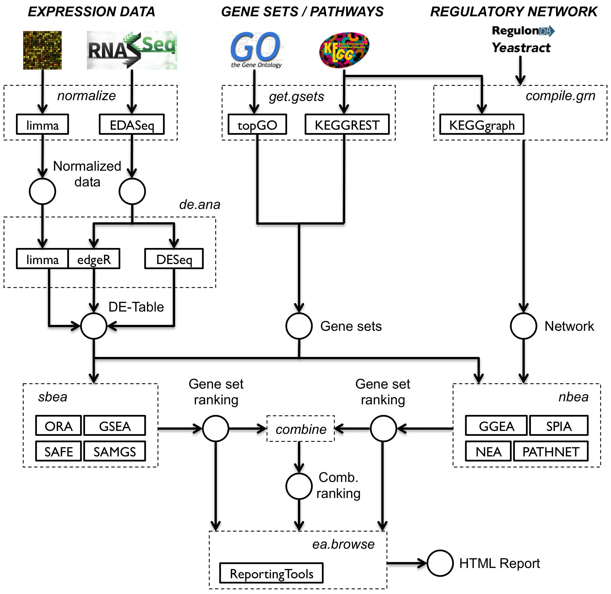
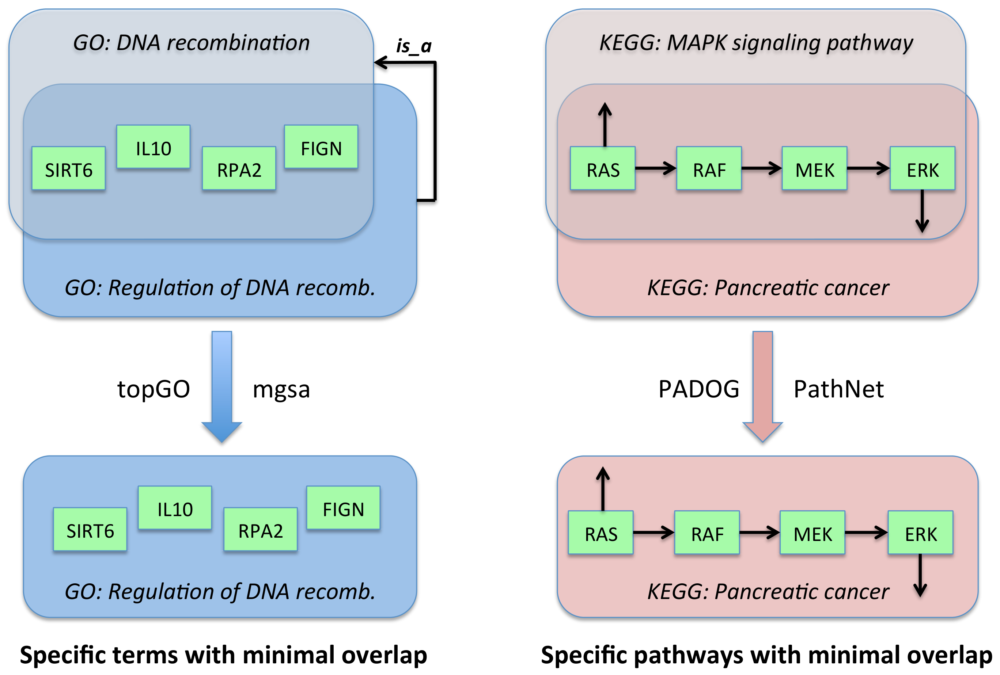
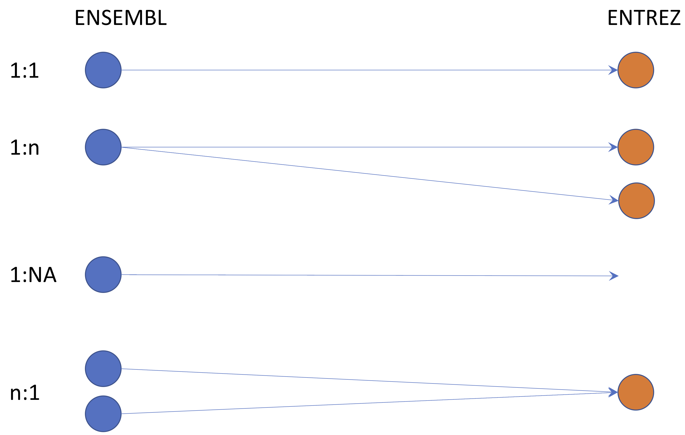
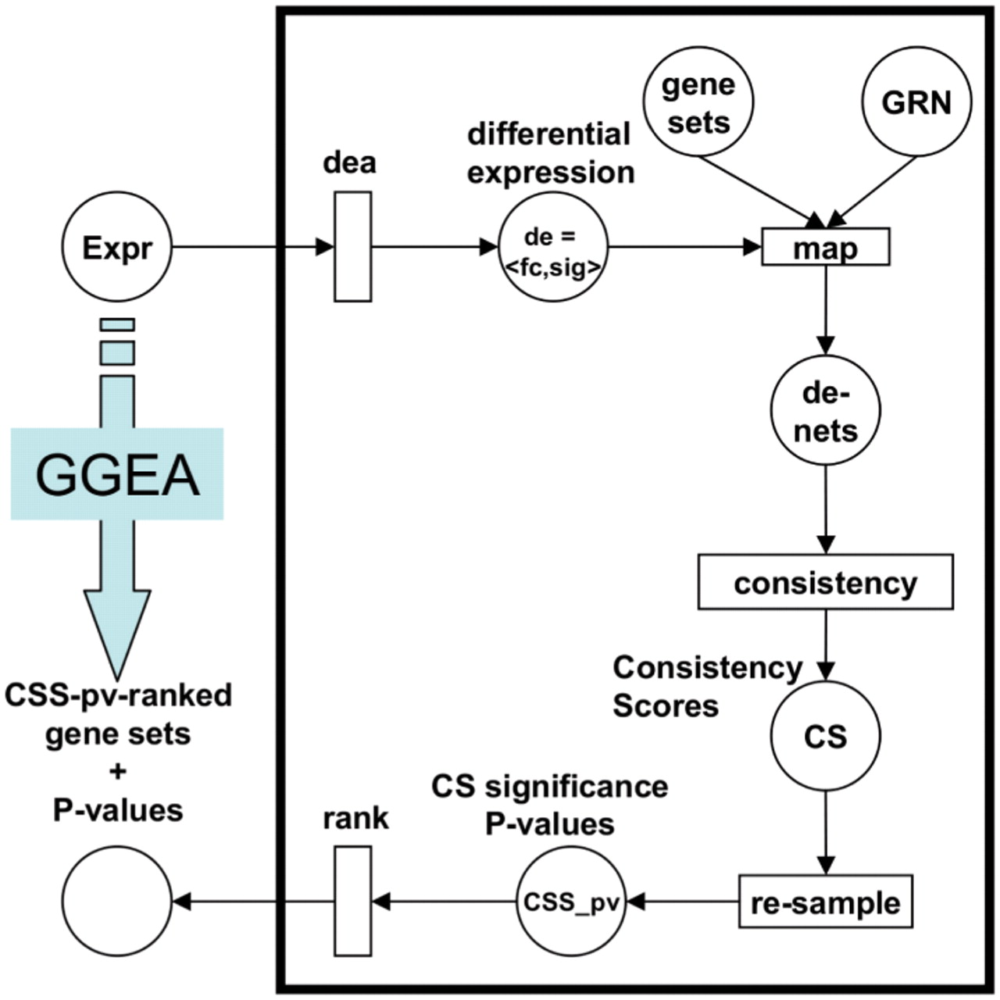
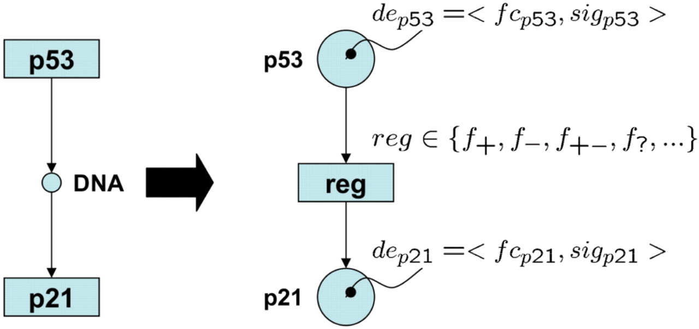

---
output:
  rmarkdown::html_document:
    highlight: pygments
    toc: false
    toc_depth: 3
    fig_width: 5
vignette: >
  %\VignetteIndexEntry{Networks and Trees}
  %\VignetteEngine{knitr::rmarkdown}
  %\VignetteEncoding[utf8]{inputenc}  
---
# Networks and Trees

Ludwig Geistlinger (<Ludwig.Geistlinger@sph.cuny.edu>)  
CUNY School of Public Health  
55 W 125th St, New York, NY 10027

## Contents of this chapter

... a lot!

- **10.2 Graph definition and visualization**
- **10.3 Gene set / network enrichment analysis** 
- **10.4 Phylogenetic trees**  
- 10.5 Analysis of microbiome data with phylogenetic trees 
- 10.6 Minimum spanning trees 


## Reasons for selecting this chapter

Geistlinger L (2016)
[Network-based analysis of gene expression data](https://edoc.ub.uni-muenchen.de/19409/1/Geistlinger_Ludwig.pdf). 
PhD Thesis.

- Geistlinger L et al. (2011)
[From sets to graphs: towards a realistic enrichment analysis of transcriptomic systems](https://doi.org/10.1093/bioinformatics/btr228).
Bioinformatics, 27(13):366--73. 
- Geistlinger L et al. (2013)
[A comprehensive gene regulatory network for the diauxic shift in Saccharomyces cerevisiae](https://doi.org/10.1093/nar/gkt631).
Nucleic Acids Research, 41(18):8452--63. 
- Geistlinger L et al. (2016)
[Bioconductor's EnrichmentBrowser: seamless navigation through combined results of
set- & network-based enrichment analysis](https://doi.org/10.1186/s12859-016-0884-1). 
BMC Bioinformatics, 17:45.

## An example graph ...

... analysis workflow implemented in the 
[EnrichmentBrowser](http://bioconductor.org/packages/EnrichmentBrowser)
package.



[Carl Adam Petri](https://en.wikipedia.org/wiki/Carl_Adam_Petri)

## 10.2 Graph definition and visualization

**Graph** $G(V,E)$:  
- set of nodes / vertices $V$ + set of edges $E$  
- undirected vs. directed graphs 

**Adjacency matrix** $A$:  
- matrix representation of $E$  
- square matrix (#rows = #columns = #nodes)  
- $A(i,j) = 1$ if there is an edge between vertices $i$ and $j$  
- $A(i,j) = 0$ otherwise  

**Network** $N$:  
- Huber/Holmes: weighted, directed graph (?)  
- terms _network_ (real systems) and _graph_ (mathematical representation) used interchangeably  
- see also:
[What's the difference between a graph and a network?](https://bence.ferdinandy.com/2018/05/27/whats-the-difference-between-a-graph-and-a-network/) 

In Chapter 2 (Stat. modeling, Karin):  
Markov chain to summarize transitions between nucleotides. 
Often schematized by a graph, here using the `igraph` package:

**Markov chains** :  
- models of dynamical systems  
- nodes = states  
- transition matrix: weighted, directed edges (arrows) between states

```{R, message=FALSE, fig.width=6, fig.height=6}
library(markovchain)
statesNames = c("A", "C", "G","T")
T1MC = new("markovchain", states = statesNames, transitionMatrix =
  matrix(c(0.2,0.1,0.4,0.3,0,1,0,0,0.1,0.2,0.2,0.5,0.1,0.1,0.8,0.0),
    nrow = 4,byrow = TRUE, dimnames=list(statesNames,statesNames)))
plot(T1MC, edge.arrow.size = 0.4, vertex.color="purple",
      edge.arrow.width = 2.2, edge.width = 5, edge.color = "blue",
      edge.curved = TRUE, edge.label.cex = 2.5, vertex.size= 32,
      vertex.label.cex = 3.5, edge.loop.angle = 3,
      vertex.label.family="sans", vertex.label.color = "white")
```

Graph layout with `ggplot2` using `ggnetwork`:  
Here is an example of plotting a graph downloaded from the [STRING](https://string-db.org)
database with node annotations.
It illustrates the perturbed chemokine subnetwork uncovered in
[Yu et al. (2012)](https://journals.plos.org/plosone/article?id=10.1371/journal.pone.0051239). 

```{R, message=FALSE}
library(igraph)
library(ggnetwork)
library(intergraph)
oldpar <- par(mar=c(5.1,4.7,4.1,2.6))

datf = read.table("files/string_graph.txt", header = TRUE)
grs = graph_from_data_frame(datf[, c("node1", "node2")], directed = FALSE)

E(grs)$weight = 1
V(grs)$size = centralization.degree(grs)$res

ggdf = ggnetwork(grs, layout = "fruchtermanreingold", cell.jitter = 0)

ggplot(ggdf, aes(x = x, y = y, xend = xend, yend = yend)) +
  geom_edges(color = "black", curvature = 0.1, size = 0.95, alpha = 0.8)+
  geom_nodes(aes(x = x, y = y), size = 3, alpha = 0.5, color = "orange") +
geom_nodelabel_repel(aes(label = vertex.names), size=4, color="#8856a7") +
#  geom_nodetext(aes(label = vertex.names), size = 4, color = "#8856a7") +
  theme_blank() + theme(legend.position = "none")

par(oldpar)
```

## 10.3 Gene set / network enrichment analysis

In Chapter 8 (HT count data, Domenick Braccia): methods for identifying differentially expressed (DE) genes. 
Obtaining a list of genes that can be declared DE is, initially, a triumph. 
However, understanding the underlying biology requires more than a list of DE genes.

### Where does it all come from?

Test whether known biological functions or processes are over-represented
(= enriched) in an experimentally-derived gene list, e.g. a list of
differentially expressed (DE) genes. See
[Goeman and Buehlmann, 2007](https://doi.org/10.1093/bioinformatics/btm051) for
a critical review.

Example: Transcriptomic study, in which 12,671 genes have been tested for
differential expression between two sample conditions and 529 genes were found
DE.

Among the DE genes, 28 are annotated to a specific functional gene set, which
contains in total 170 genes. This setup corresponds to a 2x2 contingency table,


```{R}
deTable <-
     matrix(c(28, 142, 501, 12000),
            nrow = 2,
            dimnames = list(c("DE", "Not.DE"),
                            c("In.gene.set", "Not.in.gene.set")))
deTable
```

where the overlap of 28 genes can be assessed based on the hypergeometric distribution.
This corresponds to a one-sided version of Fisher's exact test, yielding here a
significant enrichment.


```{R}
fisher.test(deTable, alternative = "greater")
```

This basic principle is at the foundation of major public and commercial enrichment
tools such as [DAVID](https://david.ncifcrf.gov/) and 
[Pathway Studio](https://www.pathwaystudio.com).

### A real world example

RNA-seq data transcriptome profiles of four primary human
airway smooth muscle cell lines in two conditions: control and treatment with
dexamethasone
[Himes et al., 2014](https://doi.org/10.1371/journal.pone.0099625).

We load the
[airway](http://bioconductor.org/packages/airway)
dataset


```{R, message=FALSE}
library(airway)
data(airway)
```

For further analysis, we only keep genes that are annotated to an ENSEMBL gene ID.

```{R}
airSE <- airway[grep("^ENSG", names(airway)), ]
dim(airSE)
```

```{R}
assay(airSE)[1:4,1:4]
```

The [EnrichmentBrowser](http://bioconductor.org/packages/EnrichmentBrowser) package implements an analysis pipeline for high-throughput gene expression data as measured with microarrays and RNA-seq. In a workflow-like manner, the package brings together a selection of established Bioconductor packages for gene expression data analysis. It integrates a wide range of gene set / network enrichment analysis methods and facilitates combination and exploration of results across methods.


```{R, message=FALSE}
library(EnrichmentBrowser)
```

### Differential expression analysis

The function `EnrichmentBrowser::deAna` implements a unified interface for 
differential expression analysis between two sample groups either based on functionality
from `limma` (includes the `voom` transformation), or alternatively, the frequently
used `edgeR` or `DESeq2` package, and  assumes some standardized variable names:
 
- **GROUP** defines the sample groups being contrasted,
- **BLOCK** defines paired samples or sample blocks, as e.g. for batch effects.

For the airway dataset, it indicates whether the cell lines have been treated
with dexamethasone (1) or not (0).

```{R}
airSE$GROUP <- ifelse(colData(airway)$dex == "trt", 1, 0)
table(airSE$GROUP)
```

Paired samples, or in general sample batches/blocks, can be defined via a
`BLOCK` column in the `colData` slot. For the airway dataset, the sample blocks
correspond to the four different cell lines.

```{R}
airSE$BLOCK <- airway$cell
table(airSE$BLOCK)
```

For RNA-seq data, the `deAna` function can be used to carry out differential 
expression analysis between the two groups either based on functionality from
*limma* (that includes the `voom` transformation), or
alternatively, the frequently used *edgeR* or *DESeq2*
package. Here, we use the analysis based on *edgeR*.


```{R}
airSE <- deAna(airSE, de.method="edgeR")
```

```{R}
rowData(airSE, use.names=TRUE)
```

### Gene sets

We are now interested in whether pre-defined sets of genes that are known to 
work together, e.g. as defined in the [Gene Ontology](http://www.geneontology.org) 
or the [KEGG](http://www.genome.jp/kegg) pathway annotation, are coordinately 
differentially expressed. 

[GO](http://www.geneontology.org) and [KEGG](http://www.genome.jp/kegg) 
annotations are most frequently used for the enrichment analysis of 
functional gene sets. Despite an increasing number of gene set and pathway 
databases, they are typically the first choice due to their long-standing 
curation and availability for a wide range of species.

**GO**:  
- three major sub-ontologies that classify gene products  
- molecular function (MF), biological process (BP) and cellular component (CC)  
- each ontology consists of GO terms that define MFs, BPs or CCs to which specific genes are annotated  
- terms are organized in a directed acyclic graph (DAG)  
- edges between the terms represent relationships of different types  
- relate terms in a parent-child scheme  
- parent terms: more general entities  
- child terms: more specific entities



**KEGG**:  
- collection of manually drawn pathway maps  
- molecular interaction and reaction networks  
- 7 broad categories of biochemical processes: metabolism, genetic and environmental information processing, cellular processes, organismal systems, human diseases, and drug development  
- metabolism and drug development pathways: reactions between chemical compounds  
- pathways of the other 5 categories: molecular interactions between genes and gene products

The function `getGenesets` can be used to download gene sets from databases such
as GO and KEGG. 
Here, we use the function to download all KEGG pathways for a chosen organism
(here: \emph{Homo sapiens}) as gene sets.

```{R, message=FALSE}
kegg.gs <- getGenesets(org="hsa", db="kegg")
```

Analogously, the function `getGenesets` can be used to retrieve GO terms of a 
selected ontology (here: biological process, BP) as defined in the *GO.db*
annotation package.


```{R, message=FALSE}
go.gs <- getGenesets(org="hsa", db="go", go.onto="BP", go.mode="GO.db")
```

### GO/KEGG overrepresentation analysis

The most basic, yet frequently used, method is the over-representation analysis
(ORA) with gene sets defined according to GO or KEGG.
As outlined in the first section, ORA tests the overlap between DE genes
(typically DE *p*-value < 0.05) and genes in a gene set based on the 
hypergeometric distribution.

```{R}
airSE <- idMap(airSE, org="hsa", from="ENSEMBL", to="ENTREZID")
```



```{R}
ora.air <- sbea(method="ora", se=airSE, gs=kegg.gs, perm=0)
gsRanking(ora.air)
```

The `eaBrowse` function creates a HTML summary from which each
gene set can be inspected in more detail.

```{R, eval=FALSE}
eaBrowse(ora.air)
```

Gene Set Enrichment Analysis (GSEA) tests whether genes of a gene set accumulate at the top or bottom of the _full_ gene vector ordered by direction and magnitude of expression change [Subramanian et al., 2005](https://doi.org/10.1073/pnas.0506580102).

```{R}
sbeaMethods()
```

[Khatri et al., 2012](https://doi.org/10.1371/journal.pcbi.1002375) divide enrichment 
methods along the timeline of development:

1. Generation: ORA methods based on the 2x2 contingency table test,
2. Generation: functional class scoring (FCS) methods such as GSEA, which compute
gene set (= functional class) scores by summarizing per-gene DE statistics,
3. Generation: topology-based methods, explicitly taking into account interactions
between genes as defined in signaling pathways and gene regulatory networks
([Geistlinger et al., 2011](https://doi.org/10.1093/bioinformatics/btr228)).

### Network-based enrichment analysis

Having found gene sets that show enrichment for differential expression, 
we are now interested whether these findings can be supported by known
regulatory interactions. 

For example, we want to know whether transcription factors and their target
genes are expressed in accordance to the connecting regulations
(activation/inhibition). 
Such information is usually given in a gene regulatory network derived from
specific experiments or compiled from the literature
([Geistlinger et al., 2013](https://doi.org/10.1093/nar/gkt631)).

There are well-studied processes and organisms for which comprehensive and
well-annotated regulatory networks are available, e.g. the
[RegulonDB](http://regulondb.ccg.unam.mx) for *E. coli* and
[Yeastract](http://www.yeastract.com) for *S. cerevisiae*. 

However, there are also cases where such a network is missing or at least
incomplete.
A simple workaround is to compile a network from regulations in pathway databases
such as KEGG.

```{R}
hsa.grn <- compileGRN(org="hsa", db="kegg")
head(hsa.grn)
```

Gene Graph Enrichment Analysis (GGEA) evaluates consistency of interactions in a
given gene regulatory network (GRN) with the observed expression data
[Geistlinger et al., 2011](https://doi.org/10.1093/bioinformatics/btr228).



GGEA first calculates a _de_ measure in [-1,1] for each gene, taking into account 
fold change and $p$-value.
Subsequently, GGEA computes a consistency score in [-1,1] for each regulatory interaction
that assesses whether the observed expression of a target gene is in agreement with
the expression change of its regulator and the interaction type (activation / inhibition).




```{R}
ggea.air <- nbea(method="ggea", se=airSE, gs=kegg.gs, grn=hsa.grn)
gsRanking(ggea.air)
```

The resulting ranking lists for each gene set the number of relations of the network between genes of the gene set under study (`NR.RELS`), the sum of consistencies over the relations of the set (`RAW.SCORE`), the score normalized by induced subnetwork size (`NORM.SCORE = RAW.SCORE / NR.RELS`), and the statistical significance of each gene set based on a permutation approach (`PVAL`).

A GGEA graph for a gene set depicts the consistency of each interaction in the set. Nodes (genes) are colored according to expression (up-/down-regulated) and edges (interactions) are colored according to consistency, i.e. how well the interaction type (activation/inhibition) is reflected in the correlation of the observed expression of both interaction partners.

```{R}
ggeaGraph(gs=kegg.gs[["hsa04930_Type_II_diabetes_mellitus"]], 
            grn=hsa.grn, se=airSE)
ggeaGraphLegend()
```

```{R}
nbeaMethods()
```


## 10.4 Phylogenetic trees

**Trees**: graphs with no cycles  

**Phylogenetic trees**:  
- rooted binary trees  
- leaves / tips: contemporary taxa (OTUs: Operational Taxonomic Units)  
- inner nodes: ancestral sequences  
- inner nodes: inferred from contemporaneous data  
- Methods for constructing phylogenetics trees: alignment of species-specific DNA sequences

```{R, message=FALSE}
library(ggtree)
load("files/tree1.RData")
tree1
```

```{R}
ggtree(tree1, lwd = 2, color = "darkgreen", alpha = 0.8, right = TRUE) +
  geom_tiplab(size = 7, angle = 90, offset = 0.05) +
  geom_point(aes(shape = isTip, color = isTip), size = 5, alpha = 0.6)
```
