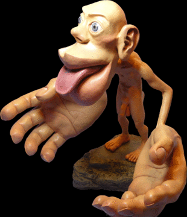

# Background

* Images are rich sources of data ("A picture is worth a 1000 words").
* We are predominantly visually oriented animals:
    * It's the sense that dominates other senses

```{r, echo = FALSE}

```

How do we make use of images?

* Quantify features, create methods to compare them to other images,
reduce noise, and find a signal

What kind of features are we looking for?

* shapes and patterns
* sizes
* intensities
* color distributions
* relative positions

For what purpose?

* Downstream analyses
    * compare effects of different drugs on cells
    * different stages of differentiation and growth
    * how cells relate to each other (clustering)

* Mainly focusing on using 2D images

What issues can we encounter that we should look out for?

* Batch effects
* Illumination
* Staining efficiency

# Goals of this chapter

* Learn how to read, write and manipulate images in R.

* Understand how to apply filters and transformations to images.

* Combine these skills to do segmentation and feature extraction; we will use
cell segmentation as an example.

* Learn how to use statistical methods to analyse spatial distributions and
dependencies.

* Get to know the most basic distribution for a spatial point process: the
homogeneous Poisson process.

* Recognize whether your data fit that basic assumption or whether they show
evidence of clumping or exclusion.

# Install MSMB Data

```{r, eval=FALSE}
if (!requireNamespace("BiocManager", quietly = TRUE))
    install.packages("BiocManager")

BiocManager::install(c("EBImage", "MSMB"))
```

**Note**: In order to install `EBImage` you need to have the `fftw3` library
installed on your system. For Linux users, please install the  library by
running: `apt install libfftw3-dev`. 

# Load mosquito image (`EBImage` package)

* Currently only 3 image formats are supported
    1. jpeg
    2. png
    3. tiff

First let's create a small helper function to avoid repetitive code:

```{r}
msmbimage <- function(filename, pkg = "MSMB") {
    system.file(package = pkg, "images", filename, mustWork = TRUE)
}
```

```{r}
library(EBImage)
imagefile <- msmbimage("mosquito.png")
mosq <- readImage(imagefile)
```

# Displaying images - `display()`

```{r}
display(mosq, method = "raster")
text(x = 85, y = 800, label = "A mosquito",
     adj = 0, col = "orange", cex = 1.5)
```

You can also display color images:

```{r}
imagefile <- msmbimage("hiv.png")
hivc <- readImage(imagefile)
display(hivc)
```

You arrange them in a grid pattern if the image has multiple frames:

```{r}
nuc <- readImage(msmbimage("nuclei.tif", pkg = "EBImage"))
display(1 - nuc, method = "raster", all = TRUE)
```

To view a single frame:

```{r}
display(1 - nuc, method = "raster", frame = 2)
```

Why did we do `1 - nuc` in the `display` function?

Because we want to invert the colors here:

```{r}
display(nuc, method = "raster", frame = 2)
```

# How are images stored in R?

```{r}
class(mosq)
showClass("Image")
```

How can you find out what the slots of an Image object are and which methods can
be applied to it?

```{r}
slotNames(mosq)
# OR
str(mosq)
```

Shortened list of methods: 

```{r,eval=FALSE}
showMethods(classes = "Image")

# Function: - (package base)
# e1="numeric", e2="Image"
#     (definition from function "Ops")
# 
# Function ".DollarNames":
#  <not an S4 generic function>
# Function: [ (package base)
# x="Image"
# 
# Function: abind (package EBImage)
# ...="Image"
# 
# Function "annotation":
#  <not an S4 generic function>
# 
# Function "annotation<-":
#  <not an S4 generic function>
# 
# Function "anyDuplicated":
#  <not an S4 generic function>
# 
# Function "append":
#  <not an S4 generic function>
# 
# Function "as.data.frame":
#  <not an S4 generic function>
# 
# Function "as.list":
#  <not an S4 generic function>
# 
# Function "asJSON":
#  <not an S4 generic function>
```

Getting the dimensions of the array:

```{r}
dim(mosq)
```

Getting to the data of the image:

```{r}
dim(imageData(mosq))
imageData(mosq)[1:3, 1:6]
```

Useful summary of the _Image_ object AKA the print method:

```{r}
mosq
```

Color Images:

```{r}
hivc
```

Comparing `colorMode` in the two images:

```{r}
colorMode(mosq)
colorMode(hivc)
```

How are images with multiple frames stored in R? (`nuc`)

```{r}
nuc
dim(imageData(nuc))
```

There are 4 frames in `nuc` so the array has 4 separate matrices in the third
dimension.

## Notes on saving images

Image files are often quite large.

A couple of things to consider:

* lossless compression: compress values of the image so that you can reconstruct
exactly to the original

* lossy compression: drop inperceptible details in image in order to save space

Lossless compression: PNG (Portable Network Graphics format)
Lossy compression: JPEG (Joint Photographic Experts Group format)

For scientific images, we want to preserve information.

```{r,eval=FALSE}
writeImage(hivc, "hivc.png", quality = 100)
```

**Note**: `RBioFormats` allows users to write to many other formats

# Manipulating images

Now that we know images are stored as arrays of values in R, we use algebra to
manipulate them!

```{r}
mosqinv <- normalize(-mosq)
```

* Adjusting contrast
* Adjust gamma-factor through exponentiation

What is the gamma-factor?

    - Used to encode or decode luminance in an image.

```{r}
knitr::include_graphics("330px-GammaCorrection_demo.jpg")
```
[Wikipedia](https://en.wikipedia.org/wiki/Gamma_correction)

```{r}
mosqcont = mosq * 3
mosqexp = mosq ^ (1/3)
```

* Crop images
* Threshold - restrict values in an image
* Transpose

```{r}
mosqcrop   = mosq[100:438, 112:550]
mosqthresh = mosq > 0.5
mosqtransp = transpose(mosq)
```

# Downloading images from the Genomic Data Commons

* `GenomicDataCommons` R package (Thanks to Sean Davis)

```{r,eval=FALSE}
library(GenomicDataCommons)

diseaseCode <- "THCA"
base_dir <- "~/data"

data_path <- file.path(base_dir, diseaseCode)

if (!dir.exists(data_path))
    dir.create(data_path, recursive = TRUE)

gdc_set_cache(data_path)

image_manifest <- files(legacy = TRUE) %>%
    filter ( ~ cases.project.project_id == "TCGA-THCA" &
        data_format == "SVS") %>%
            manifest()

mani <- head(image_manifest, 1)

gdcdata(mani$id)
```

# Additional Resources

* [Slide deck]() on Intensity Transformation and Spatial Filtering

[Slide deck]: https://slideplayer.com/slide/13753825/
