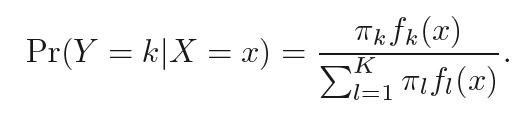
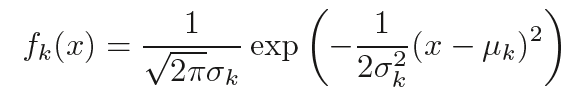
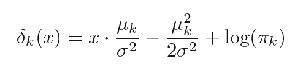
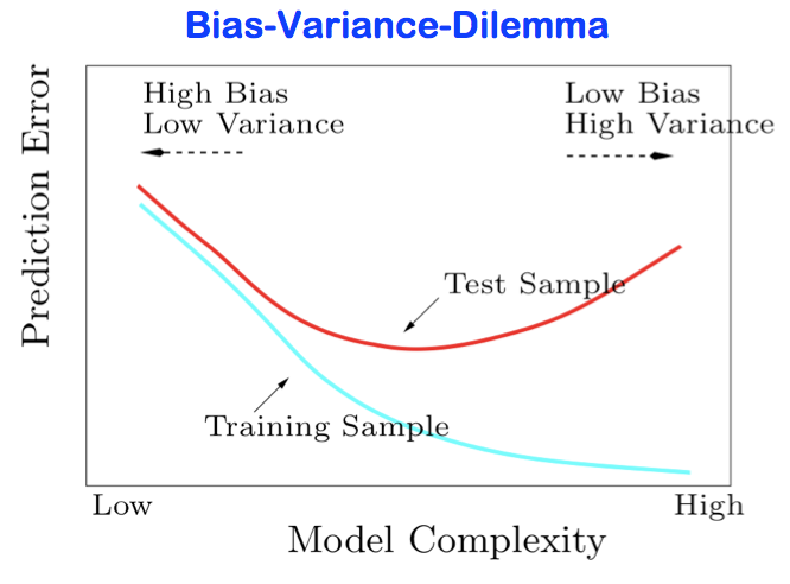
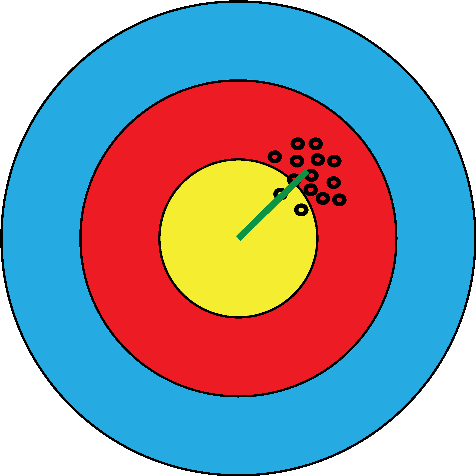
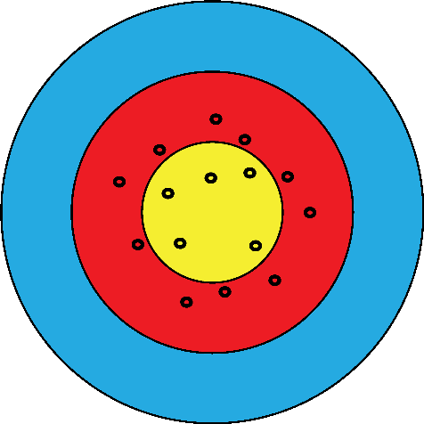
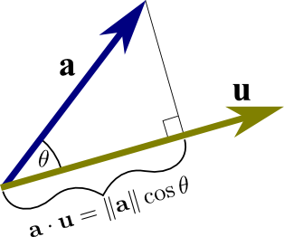

## Topics

* linear discriminant analysis 
* overfitting & the curse of dimensionality
* measures of performance
* cross-validation
* regularization and variable selection
* method hacking


<br><br>

---

<br><br>


# Linear discrimination analysis

The diabetes dataset (Reaven and Miller 1979) presents three different groups of diabetes patients and five clinical variables measured on them.
Let’s see whether we can predict the group from the insulin and glutest variables in the diabetes data.

```{r, fig.height=6, fig.width=7}
library("readr")
library("magrittr")
diabetes = read_csv("diabetes.csv", col_names = TRUE)
diabetes
diabetes$group %<>% factor

library("GGally")
ggpairs(diabetes, mapping = aes(col = group),
   columns = 2:6,upper = list(continuous = "points"), progress=FALSE)
```


```{r}
ggdb = ggplot(mapping = aes(x = insulin, y = glutest)) +
  geom_point(aes(colour = group), data = diabetes)
ggdb

library("MASS")
diabetes_lda = lda(group ~ insulin + glutest, data = diabetes)
diabetes_lda
ghat = predict(diabetes_lda)$class
table(ghat, diabetes$group)
mcr= mean(ghat != diabetes$group)
mcr
```

<br><br>

---

>Linear discriminat analyis is using Bayes' Theorem for classification.
(Source: An Introduction to Statistical Learning; Gareth James, Daniela Witten, Trevor Hastie and Robert Tibshirani; 2017)





---


```{r}
make1Dgrid = function(x) {
  rg = grDevices::extendrange(x)
  seq(from = rg[1], to = rg[2], length.out = 100)
}

diabetes_grid = with(diabetes,
  expand.grid(insulin = make1Dgrid(insulin),
              glutest = make1Dgrid(glutest)))

diabetes_grid$ghat =
  predict(diabetes_lda, newdata = diabetes_grid)$class

head(diabetes_grid)
diabetes_lda$scaling
#https://www.fbbva.es/wp-content/uploads/2017/05/dat/greenacre_c11_2010.pdf
centers = diabetes_lda$means

unitcircle = exp(1i * seq(0, 2*pi, length.out = 90)) %>%
          {cbind(Re(.), Im(.))}
ellipse = unitcircle %*% solve(diabetes_lda$scaling)

ellipses = lapply(seq_len(nrow(centers)), function(i) {
  (ellipse +
   matrix(centers[i, ], byrow = TRUE,
          ncol = ncol(centers), nrow = nrow(ellipse))) %>%
     cbind(group = i)
}) %>% do.call(rbind, .) %>% data.frame
ellipses$group %<>% factor

ggdb + geom_raster(aes(fill = ghat),
            data = diabetes_grid, alpha = 0.25, interpolate = TRUE) +
    geom_point(data = as_tibble(centers), pch = "+", size = 8) +
    geom_path(aes(colour = group), data = ellipses) +
    scale_x_continuous(expand = c(0, 0)) +
    scale_y_continuous(expand = c(0, 0))
```

---

<br><br>

What happens if we use not only <code>insuline</code> and <code>glutest</code> **(MCR=`r signif(mcr*100,3)` %)**, but all features? 

```{r}
diabetes_lda5 = lda(group ~ relwt + glufast + glutest +
                    steady + insulin, data = diabetes)
diabetes_lda5

ghat5 = predict(diabetes_lda5)$class
table(ghat5, diabetes$group)
mcr.all= mean(ghat5 != diabetes$group)
```

<br><br>

Now we get a **MCR= `r signif(mcr.all*100,3)` %** - an improvement?

<br><br>

---

<br><br>

# Machine learning vs rote learning

The central goal in statistical learning, however, is **generalizability**. We want an algorithm that is able to generalize, i.e., interpolate and extrapolate from given data to make good predictions about future data.


A "learn-by-heart" illustrating example:

```{r, echo=false, warning=false}
library("dplyr")
p = 2:21  # predictors
n = 20    # samples

mcl = lapply(p, function(pp) {
  replicate(100, {
    xmat = matrix(rnorm(n * pp), nrow = n)
    resp = sample(c("apple", "orange"), n, replace = TRUE)
    fit  = lda(xmat, resp) # data and grouping
    pred = predict(fit)$class
    mean(pred != resp) # mis-classification rate
  }) %>% mean %>% tibble(mcl = ., p = pp)
}) %>% bind_rows

ggplot(mcl, aes(x = p, y = mcl)) + geom_line() + geom_point() +
  ylab("Misclassification rate")
```

<br><br>

Make your model complex enough to fit anything?

<br>

> Well, our model performance was evaluated on the same data on which it has been trained - **bad idea**!

<br><br>

---

<br><br>

# Cross-validation


<br>
(Source: An Introduction to Statistical Learning; Gareth James, Daniela Witten, Trevor Hastie and Robert Tibshirani; 2017)

<br><br>
The key idea is to assess model performance on different data than those on which the model was trained.


```{r, warning=false}
estimate_mcl_loocv = function(x, resp) {
  vapply(seq_len(nrow(x)), function(i) {
    fit  = lda(x[-i, ], resp[-i])
    ptrn = predict(fit, newdata = x[-i,, drop = FALSE])$class
    ptst = predict(fit, newdata = x[ i,, drop = FALSE])$class
    c(train = mean(ptrn != resp[-i]), test = (ptst != resp[i]))
  }, FUN.VALUE = numeric(2)) %>% rowMeans %>% t %>% as_tibble
}

xmat = matrix(rnorm(n * last(p)), nrow = n)
resp = sample(c("apple", "orange"), n, replace = TRUE)

mcl = lapply(p, function(k) {
  estimate_mcl_loocv(xmat[, 1:k], resp)
}) %>% bind_rows %>% data.frame(p) %>% melt(id.var = "p")

ggplot(mcl, aes(x = p, y = value, col = variable)) + geom_line() +
  geom_point() + ylab("Misclassification rate")
```


<br><br>

So far we have used random data, what happens if we apply data with relevant class seperation?

```{r, warning=FALSE}
p   = 2:20
mcl = replicate(1, {
  xmat = matrix(rnorm(n * last(p)), nrow = n)
  resp = sample(c("apple", "orange"), n, replace = TRUE)
  xmat[, 1:6] = xmat[, 1:6] + as.integer(factor(resp))

  lapply(p, function(k) {
    estimate_mcl_loocv(xmat[, 1:k], resp)
  }) %>% bind_rows %>% cbind(p = p) %>% melt(id.var = "p")
}, simplify = FALSE) %>% bind_rows

mcl =  group_by(mcl, p, variable) %>%
   summarise(value = mean(value))

ggplot(mcl, aes(x = p, y = value, col = variable)) + geom_line() +
   geom_point() + ylab("Misclassification rate")

```

<br><br>

$\text{MSE} = \underbrace{\text{Var}(\hat{Y})}_{\text{variance}} + \underbrace{\mathbb{E}[\hat{Y}-Y]^2}_{\text{bias}}$

<br><br>


<br>
Idealized version of Figure 12.13, from Hastie, Tibshirani, and Friedman (2008).

<br><br>


```{r}
library(ggplot2); library(tidyverse)
ov = tibble(
  x = seq(0, 30, by = 1),
  y = 2 + 0.01 * x^2 + 0.1 * x + 2 * rnorm(length(x)))
ggplot(ov, aes(x = x, y = y)) +
  geom_point() +
  geom_smooth(span = 0.2, col = "dodgerblue3", se = FALSE) +
  geom_smooth(span = 0.8, col = "darkorange1", se = FALSE)
```

<br><br>

 



In applications, we often only get one shot, therefore being reliably almost on target can beat being right on the long term average but really off today.

<br><br>

---

## Objective function, cost function, risk function


**misclassification rate:**

$\widehat{\text{MCR}} = \frac{1}{n}\sum_{i=1}^n 𝟙_{\hat{y_i} \neq y_i}.$


For finding rare events: **Jaccard index**

$J(A,B) = \frac{|\,A\cap B\,|}{|\,A\cup B\,|}$

**probabilistic** class predictions:

$\log \text{loss} = -\frac{1}{n}\sum_{i=1}^n y_i\log(\hat{p}_i) + (1 - y_i)\log(1 - \hat{p}_i)$


For continuous continuous response variables (regression): **mean squared error**

$\widehat{\text{MSE}} = \frac{1}{n}\sum_{i=1}^n ( \hat{Y}_i - Y_i )^2$

<br><br>

---


# curse of dimensionality

```{r, fig.height=5, fig.width=5}
n = 50
cube.df = tibble(
  s = rep(c(1,2),25),
  x = runif(n),
  y = runif(n),
  z = runif(n) )

scatterplot3d::scatterplot3d(x=cube.df$x,y=cube.df$y,z=cube.df$z,color = cube.df$s)

n = 1000
df = tibble(
  p = round(10 ^ seq(0, 4, by = 0.25)),
  cv = vapply(p, function(k) {
    x1 = matrix(runif(k * n), nrow = n)
    x2 = matrix(runif(k * n), nrow = n)
    d = sqrt(rowSums((x1 - x2)^2))
    sd(d) / mean(d)
  }, FUN.VALUE = numeric(1)))
ggplot(df, aes(x = log10(p), y = cv)) + geom_line(col = "orange") +
  geom_point()
```

<br><br>

Coefficient of variation (CV) of the distance between randomly picked points in the unit hypercube, as a function of the dimension. As the dimension increases, everybody is equally far away from everyone else: there is almost no variation in the distances any more.

---

<br><br>

# Penalization the use of elastic net = lasso + ridge


<br>
(Source: An Introduction to Statistical Learning; Gareth James, Daniela Witten, Trevor Hastie and Robert Tibshirani; 2017)

<br><br>

> Example: predicting colon cancer from stool microbiome composition

Zeller et al. (2014) studied metagenome **sequencing data from fecal samples of 156 humans** that included colorectal cancer patients and tumor-free controls. Their aim was to see whether they could identify biomarkers (presence or abundance of certain taxa) that could help with early tumor detection.

<br><br>


<br><br>

```{r}
suppressMessages(library("ExperimentHub"))
eh = ExperimentHub()
eh

zeller = eh[["EH361"]]

table(zeller$disease)

zellerNC = zeller[, zeller$disease %in% c("n", "cancer")]

pData(zellerNC)[ sample(ncol(zellerNC), 3), ]

as_tibble(Biobase::exprs(zellerNC)[c(510, 527), 1:2], rownames="phyla") 

ggplot(melt(Biobase::exprs(zellerNC)[c(510, 527), ]), aes(x = value)) +
    geom_histogram(bins = 25) +
    facet_wrap( ~ Var1, ncol = 1, scales = "free")
```

```{r}
suppressMessages(library("glmnet"))
glmfit = glmnet(x = t(Biobase::exprs(zellerNC)),
                y = factor(zellerNC$disease),
                family = "binomial", alpha=1)
summary(glmfit)
```


```{r}
library(RColorBrewer)
predTrsf = predict(glmfit, newx = t(Biobase::exprs(zellerNC)),
                   type = "class", s = 0.04)
table(predTrsf, zellerNC$disease)

plot(glmfit, col = brewer.pal(8, "Dark2"), lwd = sqrt(3), ylab = "", xvar="lambda")
```

```{r}
cvglmfit = cv.glmnet(x = t(Biobase::exprs(zellerNC)),
                     y = factor(zellerNC$disease),
                     family = "binomial")
plot(cvglmfit)

cvglmfit$lambda.min
cvglmfit$lambda.1se

```
<br>
Diagnostic plot for cv.glmnet: shown is a measure of cross-validated prediction performance, the deviance, as a function of λ. The dashed vertical lines show lambda.min and lambda.1se.

<br>


<br>
Source: Wikipedia

<br><br>

```{r}
s0 = cvglmfit$lambda.1se
predict(glmfit, newx = t(Biobase::exprs(zellerNC)),type = "class", s = s0) %>%
    table(zellerNC$disease)
```


```{r}
coefs = coef(glmfit)[, which.min(abs(glmfit$lambda - s0))]
topthree = order(abs(coefs), decreasing = TRUE)[1:3]
as.vector(coefs[topthree])
names(coefs)[topthree]
```

<br><br>

## Forward-Selection with Orthogonalized Regressors

Gram-Schmidtorthogonalization helps to mitigate the **collinearity** problem by detecting and removing redundant variables. (Chen et al.,1989; Stoppiglia et al., 2003; Guyon et al., 2003)

**procedure** (Stoppiglia et al., 2003):

* select feature that best explains response variable, eg.:

* apply Gram-Schmidt orthogonalization on remainin features

* repeat process til stopping critera is met

<br><br>

# Method hacking

* a large choice of methods -> CRAN task view Machine Learning & Statistical Learning
* challenging heterogeneity of tuning parameter interfaces -> caret package
* R & Tensorflow

<br><br>

In Chapter 6 we encountered p-value hacking. A similar phenomenon exists in statistical learning: given a dataset, we explore various different methods of preprocessing (such as normalization, outlier detection, transformation, feature selection), try out different machine learning algorithms and tune their parameters until we are content with the result. The measured accuracy is likely to be too optimistic, i.e., will not generalize to a new dataset. Embedding as many of our methodical choices into a computational formalism and having an **outer cross-validation** loop (not to be confused with the inner loop that does the parameter tuning) will ameliorate the problem. But is unlikely to address it completely, since not all our choices can be formalized.

<br><br>

The gold standard remains **validation on truly unseen data**. In addition, it is never a bad thing if the classifier is not a black box but can be **interpreted in terms of domain knowledge**. Finally, report not just summary statistics, such as misclassification rates, but lay open the complete **computational workflow**, so that anyone (including your future self) can convince themselves of the robustness of the result or of the influence of the preprocessing, model selection and tuning choices (Holmes 2018).

---
