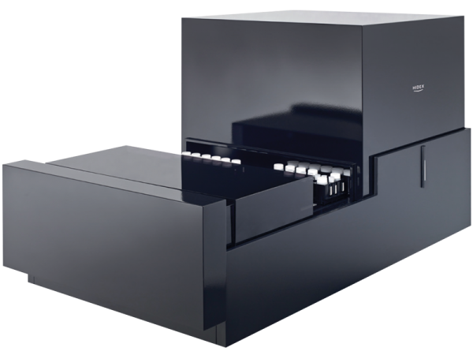

Robust Summaries & Rank tests
========================================================
author: Lucas Schiffer
date: March 07, 2016
autosize: true
Data Analysis for the Life Sciences

Topics
========================================================
- Introduction
- Median
- Median Absolute Deviation
- Spearman Correlation
- Symmetry of Log Ratios
- Wilcoxon Rank Sum Test

Introduction
========================================================
<p style="text-align: center">

<br>
Thermal Cycler
<a href="https://tinyurl.com/z5meacs" style="display: block; font-size: small">https://tinyurl.com/z5meacs</a>
</p>
<p style="text-align: center">

<br>
Flow Cytometer
<a href="https://tinyurl.com/zfgun7w" style="display: block; font-size: small">https://tinyurl.com/zfgun7w</a>
</p>
***
<p style="text-align: center">

<br>
Liquid Scintillation Counter
<a href="https://tinyurl.com/jerufaq" style="display: block; font-size: small">https://tinyurl.com/jerufaq</a>
</p>
<p style="text-align: center">

<br>
FTIR Spectrometer
<a href="https://tinyurl.com/hdrzs6x" style="display: block; font-size: small">https://tinyurl.com/hdrzs6x</a>
</p>

Introduction
========================================================
left: 35%


```
Mean =  1.11 
SD = 10.03 
Median = 0.17
```
***
- Expensive Devices Make Mistakes
- Expert Researchers Make Mistakes
- Systematic Errors Occur Often
- Random Errors Occur Often
- Equipment Cost ≠ Error Rate

Median
========================================================
- Robust to Outliers
- For Ordered Data, Given by the Middle Term
- Must Average Two Terms Where n of Terms is Even
- The Smallest Value of i that Satisfies the Inequality

$$\sum_{i=1}^{j} f_i ≥ \frac{n+1}{2}$$

Median
========================================================


```
Mean =  1.11 
SD = 10.03 
Median = 0.17
```
***


```
Mean =  0.11 
SD = 0.9 
Median = 0.11
```

Median Absolute Deviation
========================================================
- Robust version of standard deviation
- Compute the Difference Between Each Point and the Median
- Then Take the Median of Their Absolute Values

$$\operatorname{MAD} = \operatorname{median}_{i}\left(\ \left| X_{i} - \operatorname{median}_{j} (X_{j}) \right|\ \right), \$$

Median Absolute Deviation
========================================================


```
SD = 10.03
```
***


```
MAD = 0.89
```

Spearman Correlation
========================================================
- Also Known as Spearman's Rho
- Raw Values Are Standardized and Ranked
- Ranked Values Range from 0 to 1
- Robust Because Outliers Rank Lower

$$r_s = \rho_{\operatorname{rg}_X,\operatorname{rg}_Y} = \frac {\operatorname{cov}(\operatorname{rg}_X,\operatorname{rg}_Y)} { \sigma_{\operatorname{rg}_X} \sigma_{\operatorname{rg}_Y} }$$

Spearman Correlation
========================================================

***


Symmetry of Log Ratios
========================================================
- Properties of Logarithms Yields Symetric Ratios
- Allows for Normalization of Exponential Data
- Data Becomes Linear, More Amenable to Analysis
- Robust Statistics for Exponential Data 

$$\log(x/y)=\log(x)-\log(y)=-(\log(y)-\log(x))=\log(y/x)$$

Symmetry of Log Ratios
========================================================

***


Symmetry of Log Ratios
========================================================

***


Wilcoxon Rank Sum Test
========================================================
- Also Known as the Mann-Whitney Test
- Just as Mean and Standard Deviation are Suseptible to Outliers, so too is the T-Test
- In Essence Data are Combined, Ranked, Stratified into Groups, and Finally Given an Average Rank
- Provides a Non-Parametric Method for Hypothesis Testing

Wilcoxon Rank Sum Test
========================================================


```
t-test pval: 0.04439948
```
***


```
Wilcox test pval: 0.1310212
```

The End
========================================================
#### The Exercises <- http://rpubs.com/schifferl/rse
