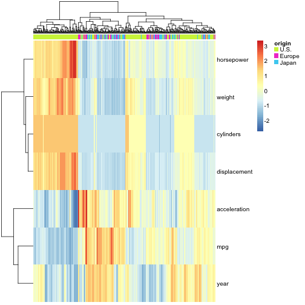
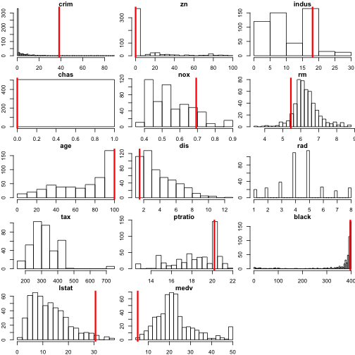

Note - to show the output in this directory on github, I did the following:

1. create a .md file by loading R and doing:

> library(knitr)
> knit("ISLR_Chapter2.Rmd")

2. This created a file called ISLR_Chapter2.md.  I renamed this to
README.md, then added these extra comments at the top.

3. Within the /week2 subdirectory, add README.md and
/week2/figure. Commit and push.  That's it.

A built html version of this document is available at
http://rpubs.com/lwaldron/islrchapter2

# Problem 8
First load the data using the ISLR package:

```r
library(ISLR)
data(College)
```

## Part c
**i. Use the summary() function to produce a numerical summary of the variables in the data set.**

```r
summary(College)
```

```
##  Private        Apps           Accept          Enroll       Top10perc   
##  No :212   Min.   :   81   Min.   :   72   Min.   :  35   Min.   : 1.0  
##  Yes:565   1st Qu.:  776   1st Qu.:  604   1st Qu.: 242   1st Qu.:15.0  
##            Median : 1558   Median : 1110   Median : 434   Median :23.0  
##            Mean   : 3002   Mean   : 2019   Mean   : 780   Mean   :27.6  
##            3rd Qu.: 3624   3rd Qu.: 2424   3rd Qu.: 902   3rd Qu.:35.0  
##            Max.   :48094   Max.   :26330   Max.   :6392   Max.   :96.0  
##    Top25perc      F.Undergrad     P.Undergrad       Outstate    
##  Min.   :  9.0   Min.   :  139   Min.   :    1   Min.   : 2340  
##  1st Qu.: 41.0   1st Qu.:  992   1st Qu.:   95   1st Qu.: 7320  
##  Median : 54.0   Median : 1707   Median :  353   Median : 9990  
##  Mean   : 55.8   Mean   : 3700   Mean   :  855   Mean   :10441  
##  3rd Qu.: 69.0   3rd Qu.: 4005   3rd Qu.:  967   3rd Qu.:12925  
##  Max.   :100.0   Max.   :31643   Max.   :21836   Max.   :21700  
##    Room.Board       Books         Personal         PhD       
##  Min.   :1780   Min.   :  96   Min.   : 250   Min.   :  8.0  
##  1st Qu.:3597   1st Qu.: 470   1st Qu.: 850   1st Qu.: 62.0  
##  Median :4200   Median : 500   Median :1200   Median : 75.0  
##  Mean   :4358   Mean   : 549   Mean   :1341   Mean   : 72.7  
##  3rd Qu.:5050   3rd Qu.: 600   3rd Qu.:1700   3rd Qu.: 85.0  
##  Max.   :8124   Max.   :2340   Max.   :6800   Max.   :103.0  
##     Terminal       S.F.Ratio     perc.alumni       Expend     
##  Min.   : 24.0   Min.   : 2.5   Min.   : 0.0   Min.   : 3186  
##  1st Qu.: 71.0   1st Qu.:11.5   1st Qu.:13.0   1st Qu.: 6751  
##  Median : 82.0   Median :13.6   Median :21.0   Median : 8377  
##  Mean   : 79.7   Mean   :14.1   Mean   :22.7   Mean   : 9660  
##  3rd Qu.: 92.0   3rd Qu.:16.5   3rd Qu.:31.0   3rd Qu.:10830  
##  Max.   :100.0   Max.   :39.8   Max.   :64.0   Max.   :56233  
##    Grad.Rate    
##  Min.   : 10.0  
##  1st Qu.: 53.0  
##  Median : 65.0  
##  Mean   : 65.5  
##  3rd Qu.: 78.0  
##  Max.   :118.0
```


**ii. Use the pairs() function to produce a scatterplot matrix of the first ten columns or variables of the data. Recall that you can reference the first ten columns of a matrix A using A[,1:10].**


```r
pairs(College[, 1:10])
```

 

**iii. Use the plot() function to produce side-by-side boxplots of Outstate versus Private.**

Since the problem doesn't say which variable to make the boxplot for, I use all 16 other quantitative variables.  In the par() command, mfrow=c(4, 4) makes a 4x4 panel plot, and mar=c(3,2,0,0) makes smaller margins around each plot - see ?par for explanations of these arguments.  See ?boxplot for explanations of xlab, ylab, and main.


```r
par(mfrow=c(4,4), mar=c(2, 2, 1, 0))
for (i in 2:17)
  boxplot(College[, i] ~ College[, 1], xlab="", main=colnames(College)[i])
```

 

**iv. Create a new qualitative variable, called Elite, by binning the Top10perc variable. We are going to divide universities into two groups based on whether or not the proportion of students coming from the top 10% of their high school classes exceeds 50 %.  Use the summary() function to see how many elite univer- sities there are.**


```r
College$Elite <- College$Top10perc > 50
summary(College[, c("Top10perc", "Elite")])
```

```
##    Top10perc      Elite        
##  Min.   : 1.0   Mode :logical  
##  1st Qu.:15.0   FALSE:699      
##  Median :23.0   TRUE :78       
##  Mean   :27.6   NA's :0        
##  3rd Qu.:35.0                  
##  Max.   :96.0
```

**Now use the plot() function to produce side-by-side boxplots of Outstate versus Elite.**


```r
boxplot(Outstate ~ Elite, data=College)
```

 


**v. Use the hist() function to produce some histograms with differing numbers of bins for a few of the quantitative vari- ables. You may find the command par(mfrow=c(2,2)) useful: it will divide the print window into four regions so that four plots can be made simultaneously. Modifying the arguments to this function will divide the screen in other ways.**

Just one example:

```r
par(mfrow=c(2,2))
hist(College$Top10perc, breaks=5)
hist(College$Top10perc, breaks=10)
hist(College$Top10perc, breaks=20)
hist(College$Top10perc, breaks=40)
```

 

**vi. Continue exploring the data, and provide a brief summary of what you discover.**

How about a heatmap of the data.  To help with interpretation, here's the codebook:

* *Private*: Public/private indicator
* *Apps*: Number of applications received
* *Accept*: Number of applicants accepted
* *Enroll*: Number of new students enrolled
* *Top10perc*: New students from top 10 % of high school class 
* *Top25perc*: New students from top 25 % of high school class 
* *F.Undergrad*: Number of full-time undergraduates
* *P.Undergrad*: Number of part-time undergraduates
* *Outstate*: Out-of-state tuition
* *Room.Board*: Room and board costs
* *Books*: Estimated book costs
* *Personal*: Estimated personal spending
* *PhD*: Percent of faculty with Ph.D.’s
* *Terminal*: Percent of faculty with terminal degree
* *S.F.Ratio*: Student/faculty ratio
* *perc.alumni*: Percent of alumni who donate
* *Expend*: Instructional expenditure per student
* *Grad.Rate*: Graduation rate

Note that for this plot, we:
1. standardize each variable to mean 0 and standard deviation 1 using scale(), 
2. convert the data.frame to a matrix as required by heatmap functions,
3. transpose the matrix to show the variables as rows rather than columns, just for convenient viewing,
4. use the pheatmap library, just because it by default produces a prettier heatmap than the built-in heatmap, and
5. Annotate the columns by whether the university is private or not.


```r
library(pheatmap)
pheatmap(t(as.matrix(scale(College[, 2:18]))),
         annotation=College[1],
         show_colnames=FALSE)
```

 

## Problem 9. 
**This exercise involves the Auto data set studied in the lab. Make sure that the missing values have been removed from the data.**

```{}
data(Auto)
```

Are there any missing values?  No:

```r
summary(complete.cases(Auto))
```

```
##    Mode    TRUE    NA's 
## logical     392       0
```

**(a) Which of the predictors are quantitative, and which are qualitative?**


```r
sapply(Auto, class)
```

```
##          mpg    cylinders displacement   horsepower       weight 
##    "numeric"    "numeric"    "numeric"    "numeric"    "numeric" 
## acceleration         year       origin         name 
##    "numeric"    "numeric"    "numeric"     "factor"
```

Name is qualitative, the rest are quantitative.  However, looking at summary(), we notice that the "origin" variable takes only values of 1, 2, 3 and should probably be treated as factor:

```r
summary(Auto)
```

```
##       mpg         cylinders     displacement   horsepower   
##  Min.   : 9.0   Min.   :3.00   Min.   : 68   Min.   : 46.0  
##  1st Qu.:17.0   1st Qu.:4.00   1st Qu.:105   1st Qu.: 75.0  
##  Median :22.8   Median :4.00   Median :151   Median : 93.5  
##  Mean   :23.4   Mean   :5.47   Mean   :194   Mean   :104.5  
##  3rd Qu.:29.0   3rd Qu.:8.00   3rd Qu.:276   3rd Qu.:126.0  
##  Max.   :46.6   Max.   :8.00   Max.   :455   Max.   :230.0  
##                                                             
##      weight      acceleration       year        origin    
##  Min.   :1613   Min.   : 8.0   Min.   :70   Min.   :1.00  
##  1st Qu.:2225   1st Qu.:13.8   1st Qu.:73   1st Qu.:1.00  
##  Median :2804   Median :15.5   Median :76   Median :1.00  
##  Mean   :2978   Mean   :15.5   Mean   :76   Mean   :1.58  
##  3rd Qu.:3615   3rd Qu.:17.0   3rd Qu.:79   3rd Qu.:2.00  
##  Max.   :5140   Max.   :24.8   Max.   :82   Max.   :3.00  
##                                                           
##                  name    
##  amc matador       :  5  
##  ford pinto        :  5  
##  toyota corolla    :  5  
##  amc gremlin       :  4  
##  amc hornet        :  4  
##  chevrolet chevette:  4  
##  (Other)           :365
```

Looking at some representative names for each origin, it's clear that origin=1 is U.S.-made, origin=2 is European, and origin=3 is Japanese:

```r
head(unique(Auto$name[Auto$origin==1]), 10)
```

```
##  [1] chevrolet chevelle malibu buick skylark 320        
##  [3] plymouth satellite        amc rebel sst            
##  [5] ford torino               ford galaxie 500         
##  [7] chevrolet impala          plymouth fury iii        
##  [9] pontiac catalina          amc ambassador dpl       
## 304 Levels: amc ambassador brougham ... vw rabbit custom
```

```r
head(unique(Auto$name[Auto$origin==2]), 10)
```

```
##  [1] volkswagen 1131 deluxe sedan peugeot 504                 
##  [3] audi 100 ls                  saab 99e                    
##  [5] bmw 2002                     opel 1900                   
##  [7] peugeot 304                  fiat 124b                   
##  [9] volkswagen model 111         volkswagen type 3           
## 304 Levels: amc ambassador brougham ... vw rabbit custom
```

```r
head(unique(Auto$name[Auto$origin==3]), 10)
```

```
##  [1] toyota corona mark ii       datsun pl510               
##  [3] toyota corona               toyota corolla 1200        
##  [5] datsun 1200                 toyota corona hardtop      
##  [7] mazda rx2 coupe             datsun 510 (sw)            
##  [9] toyouta corona mark ii (sw) toyota corolla 1600 (sw)   
## 304 Levels: amc ambassador brougham ... vw rabbit custom
```

So let's fix this and turn it into a factor:

```r
Auto$origin <- factor(Auto$origin, levels=1:3, labels=c("U.S.", "Europe", "Japan"))
```

Now we've corrected origin so that both origin and name are factors:

```r
sapply(Auto, class)
```

```
##          mpg    cylinders displacement   horsepower       weight 
##    "numeric"    "numeric"    "numeric"    "numeric"    "numeric" 
## acceleration         year       origin         name 
##    "numeric"    "numeric"     "factor"     "factor"
```

Let's create a logical vector indicating which variables are quantitative (numeric):

```r
quant <- sapply(Auto, is.numeric)
quant
```

```
##          mpg    cylinders displacement   horsepower       weight 
##         TRUE         TRUE         TRUE         TRUE         TRUE 
## acceleration         year       origin         name 
##         TRUE         TRUE        FALSE        FALSE
```


**(b) What is the range of each quantitative predictor? You can answer this using the range() function.**

```r
sapply(Auto[, quant], range)
```

```
##       mpg cylinders displacement horsepower weight acceleration year
## [1,]  9.0         3           68         46   1613          8.0   70
## [2,] 46.6         8          455        230   5140         24.8   82
```

**(c) What is the mean and standard deviation of each quantitative predictor?**

I'll round to two significant digits using signif(). Note first row is mean, second is sd:

```r
sapply(Auto[, quant], function(x) signif(c(mean(x), sd(x)), 2))
```

```
##       mpg cylinders displacement horsepower weight acceleration year
## [1,] 23.0       5.5          190        100   3000         16.0 76.0
## [2,]  7.8       1.7          100         38    850          2.8  3.7
```

**(d) Now remove the 10th through 85th observations. What is the range, mean, and standard deviation of each predictor in the subset of the data that remains?**

For the heck of it, I'll add rownames.  And round to two decimal places, rather than two significant digits (using round() instead of signif()):

```r
output <- sapply(Auto[-10:-85, quant], function(x) round(c(range(x), mean(x), sd(x)), 2))
rownames(output) <- c("min", "max", "mean", "sd")
output
```

```
##        mpg cylinders displacement horsepower weight acceleration  year
## min  11.00      3.00        68.00      46.00 1649.0         8.50 70.00
## max  46.60      8.00       455.00     230.00 4997.0        24.80 82.00
## mean 24.40      5.37       187.24     100.72 2936.0        15.73 77.15
## sd    7.87      1.65        99.68      35.71  811.3         2.69  3.11
```

**(e) Using the full data set, investigate the predictors graphically, using scatterplots or other tools of your choice. Create some plots highlighting the relationships among the predictors. Comment on your findings.**

How about a heatmap again:

```r
library(pheatmap)
pheatmap(t(scale(as.matrix(Auto[, quant]))), 
         annotation=Auto["origin"],
         show_colnames=FALSE)
```

 

**(f) Suppose that we wish to predict gas mileage (mpg) on the basis of the other variables. Do your plots suggest that any of the other variables might be useful in predicting mpg? Justify your answer.**

Yes, it would appear that year, acceleration, and origin would be decent predictors of mpg.

## Problem 10. 

**This exercise involves the Boston housing data set. (a) To begin, load in the Boston data set. The Boston data set is part of the MASS library in R.**

```r
library(MASS)
```

```
## Warning: package 'MASS' was built under R version 3.1.1
```
**Now the data set is contained in the object Boston.  Read about the data set:** (note I use eval=FALSE in this code chunk so it isn't actually evaluated by R, just shown on the screen)

```r
?Boston
```

**How many rows are in this data set? How many columns? What do the rows and columns represent?**


```r
dim(Boston)
```

```
## [1] 506  14
```
506 rows, 14 columns.


```r
summary(Boston)
```

```
##       crim             zn            indus            chas       
##  Min.   : 0.01   Min.   :  0.0   Min.   : 0.46   Min.   :0.0000  
##  1st Qu.: 0.08   1st Qu.:  0.0   1st Qu.: 5.19   1st Qu.:0.0000  
##  Median : 0.26   Median :  0.0   Median : 9.69   Median :0.0000  
##  Mean   : 3.61   Mean   : 11.4   Mean   :11.14   Mean   :0.0692  
##  3rd Qu.: 3.68   3rd Qu.: 12.5   3rd Qu.:18.10   3rd Qu.:0.0000  
##  Max.   :88.98   Max.   :100.0   Max.   :27.74   Max.   :1.0000  
##       nox              rm            age             dis       
##  Min.   :0.385   Min.   :3.56   Min.   :  2.9   Min.   : 1.13  
##  1st Qu.:0.449   1st Qu.:5.89   1st Qu.: 45.0   1st Qu.: 2.10  
##  Median :0.538   Median :6.21   Median : 77.5   Median : 3.21  
##  Mean   :0.555   Mean   :6.29   Mean   : 68.6   Mean   : 3.79  
##  3rd Qu.:0.624   3rd Qu.:6.62   3rd Qu.: 94.1   3rd Qu.: 5.19  
##  Max.   :0.871   Max.   :8.78   Max.   :100.0   Max.   :12.13  
##       rad             tax         ptratio         black      
##  Min.   : 1.00   Min.   :187   Min.   :12.6   Min.   :  0.3  
##  1st Qu.: 4.00   1st Qu.:279   1st Qu.:17.4   1st Qu.:375.4  
##  Median : 5.00   Median :330   Median :19.1   Median :391.4  
##  Mean   : 9.55   Mean   :408   Mean   :18.5   Mean   :356.7  
##  3rd Qu.:24.00   3rd Qu.:666   3rd Qu.:20.2   3rd Qu.:396.2  
##  Max.   :24.00   Max.   :711   Max.   :22.0   Max.   :396.9  
##      lstat            medv     
##  Min.   : 1.73   Min.   : 5.0  
##  1st Qu.: 6.95   1st Qu.:17.0  
##  Median :11.36   Median :21.2  
##  Mean   :12.65   Mean   :22.5  
##  3rd Qu.:16.95   3rd Qu.:25.0  
##  Max.   :37.97   Max.   :50.0
```
Columns are variables, rows are observations.

**(b) Make some pairwise scatterplots of the predictors (columns) in this data set. Describe your findings.**

```r
pairs(Boston)
```

 
That's a lot of small scatterplots.  Maybe a heatmap will be easier to read:

```r
pheatmap(t(scale(as.matrix(Boston))), 
         show_colnames=FALSE)
```

 
Notice "chas" is a binary variable.  "crim" has outliers.  There are some collinear variables, like rad/tax, and rad/tax have a lot of constant values:

```r
summary(Boston$rad)
```

```
##    Min. 1st Qu.  Median    Mean 3rd Qu.    Max. 
##    1.00    4.00    5.00    9.55   24.00   24.00
```

```r
table(Boston$rad)
```

```
## 
##   1   2   3   4   5   6   7   8  24 
##  20  24  38 110 115  26  17  24 132
```
It's those 24's that stand out in the heatmap - I'll bet these are some kind of weird coding and not real values of 24.  Let's set those to NA:

```r
Boston$rad[Boston$rad==24] <- NA
```

tax has a lot of "666" values that I don't believe are really 666:

```r
table(Boston$tax)
```

```
## 
## 187 188 193 198 216 222 223 224 226 233 241 242 243 244 245 247 252 254 
##   1   7   8   1   5   7   5  10   1   9   1   2   4   1   3   4   2   5 
## 255 256 264 265 270 273 276 277 279 280 281 284 285 287 289 293 296 300 
##   1   1  12   2   7   5   9  11   4   1   4   7   1   8   5   3   8   7 
## 304 305 307 311 313 315 329 330 334 335 337 345 348 351 352 358 370 384 
##  14   4  40   7   1   2   6  10   2   2   2   3   2   1   2   3   2  11 
## 391 398 402 403 411 422 430 432 437 469 666 711 
##   8  12   2  30   2   1   3   9  15   1 132   5
```
so let's set those to NA as well:

```r
Boston$tax[Boston$tax==666] <- NA
```

There are no doubt other variables that need to be cleaned as well (like ptratio for sure) but you get the picture...  Data cleaning is hard.

**(c) Are any of the predictors associated with per capita crime rate? If so, explain the relationship.**

Let's make a heatmap of correlations, calculating correlations using pairwise complete observations (for a given pair of variables, neither has a missing value).  It looks like there are a number of variables associated with "crim": ptratio, rad, tax, lstat, age, indus and nox.

```r
pheatmap(cor(Boston, use="pairwise.complete.obs"))
```

 

**(d) Do any of the suburbs of Boston appear to have particularly high crime rates? Tax rates? Pupil-teacher ratios? Comment on the range of each predictor.**

Make histograms of each.  breaks="FD" tends to result in more bins in the histogram than the default:

```r
par(mfrow=c(2,2))
hist(Boston$crim, main="Crime Rates\n (note the long tail)",breaks="FD")
hist(Boston$crim, main="Crime Rates with y-axis limited", 
     ylim=c(0, 40), breaks="FD")
hist(Boston$tax, main="Tax rates\n (note some high-tax outliers)", breaks="FD")
hist(Boston$ptratio, main="Pupil-teacher ratio\n (no real outliers)", breaks="FD")
```

 

**(e) How many of the suburbs in this data set bound the Charles river?**

```r
summary(Boston$chas==1) ## (=1 if tract bounds river; 0 otherwise)
```

```
##    Mode   FALSE    TRUE    NA's 
## logical     471      35       0
```

**(f) What is the median pupil-teacher ratio among the towns in this data set?**

```r
median(Boston$ptratio)
```

```
## [1] 19.05
```

**(g) Which suburb of Boston has lowest median value of owner- occupied homes?**

We don't have suburb names, but it's #399:

```r
which.min(Boston$medv)
```

```
## [1] 399
```

**What are the values of the other predictors for that suburb, and how do those values compare to the overall ranges for those predictors? Comment on your findings.**

From the ?Boston codebook to help interpret these histograms:

* **crim**: per capita crime rate by town.
* **zn**: proportion of residential land zoned for lots over 25,000 sq.ft.
* **indus**: proportion of non-retail business acres per town.
* **chas**: Charles River dummy variable (= 1 if tract bounds river; 0 otherwise).
* **nox**: nitrogen oxides concentration (parts per 10 million).
* **rm**: average number of rooms per dwelling.
* **age**: proportion of owner-occupied units built prior to 1940.
* **dis**: weighted mean of distances to five Boston employment centres.
* **rad**: index of accessibility to radial highways.
* **tax**: full-value property-tax rate per \$10,000.
* **ptratio**: pupil-teacher ratio by town.
* **black**: $1000 (Bk - 0.63)^2$ where Bk is the proportion of blacks by town.
* **lstat**: lower status of the population (percent).
* **medv**: median value of owner-occupied homes in \$1000s.


```r
par(mfrow=c(5,3), mar=c(2, 2, 1, 0))
for (i in 1:ncol(Boston)){
  hist(Boston[, i], main=colnames(Boston)[i], breaks="FD")
  abline(v=Boston[399, i], col="red", lw=3)
}
```

 

**(h) In this data set, how many of the suburbs average more than seven rooms per dwelling?**

```r
summary(Boston$rm > 7)
```

```
##    Mode   FALSE    TRUE    NA's 
## logical     442      64       0
```

**More than eight rooms per dwelling?**

```r
summary(Boston$rm > 8)
```

```
##    Mode   FALSE    TRUE    NA's 
## logical     493      13       0
```

**Comment on the suburbs that average more than eight rooms per dwelling.**

First, create a logical index for which suburbs these are:

```r
idx <- Boston$rm > 8
summary(idx)
```

```
##    Mode   FALSE    TRUE    NA's 
## logical     493      13       0
```

Let's repeat the histograms again, and show red lines for these (subset rows using idx instead of 399:

```r
par(mfrow=c(5,3), mar=c(2, 2, 1, 0))
for (i in 1:ncol(Boston)){
  hist(Boston[, i], main=colnames(Boston)[i], breaks="FD")
  abline(v=Boston[idx, i], col="red", lw=1)
}
```

 
